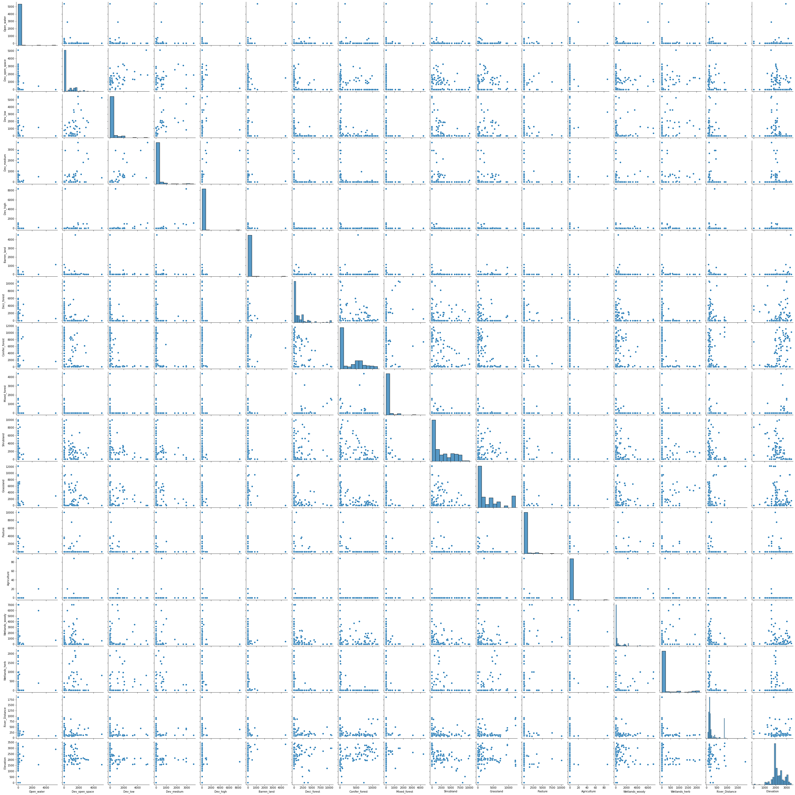
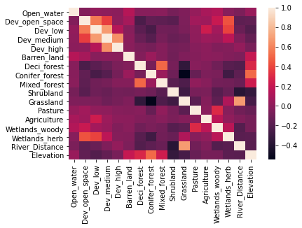

## Using QGIS and Support Vector Machines to Differentiate Species of Meadow Jumping Mice (*Zapus hudsonius*) and Western Jumping Mice (*Zapus princeps*)
**Matthew Clark**

**Introduction**

Colorado is home to two different jumping mouse species, the meadow jumping mouse (*Zapus hudsonius*) and the western jumping mouse (*Zapus princeps*). Many of the subspecies of meadow jumping mice including the Preble's meadow jumping mouse (*Zapus hudsonius preblei*) are listed as endangered (US Fish and Wildlife Service, 2021). Conservation plans for construction along the Front Range frequently have to include plans to avoid or minimize negative effects on the jumping mice. In contrast, the western jumping mouse is thriving. This project will look into whether habitat differences between the two species can be classified by a machine learning algorithm. This will take the form of a support vector machine learner. The goal of the project is to specifically see if the habitat characteristics of meadow jumping mouse habitat can be detected by the SVM. For this reason, the sightings of meadow  jumping mice and western jumping mice will be compared to see if the model can tell the differences between them. The US Fish and Wildlife Service recommends that habitat for the Preble's meadow jumping mouse be within 110 meters of a water body, be it a stream, river, pond or lake (Trainor et. al. 2012). However, Trainor et. al. (2012) have found that some mice can be found as far as 340 meters from a body of water. These parameters would be important in this project. 

**Data Sources**

Data was acquired from BISON (Biodiversity Information Serving Our Nation) in the form of point shapefiles containing data on the geographic location of the specimens, the institutions who collected the data, taxonomic information and the date in which it was collected (BISON, n.d.). All data points before 1990 were excluded as the areas where this data was found may have been developed by the present day. In addition the data was clipped to just include data points from Colorado. Institutions who contributed to the data include the Denver Museum of Nature and Science, NatureServe Network, the Museum of Southwestern Biology, Fort Hayes Sternberg Museum of Natural History, University of Alaska Museum of the North, iNaturalist.org, Angelo State Natural History Museum, Charles R. Conner Museum and the University of Colorado Museum of Natural History.

Data for land cover was retrieved from the US Geological Survey's *2011 National Land Cover Dataset* or NLDS 2011 (United States Geological Survey, 2011). This dataset contains 20 different land cover types. This study included open water, open space, developed areas (low, medium and high), barren ground, deciduous forests, coniferous forests, mixed forests, shrubs, grasslands, pasture, agricultural areas, wooded wetlands and herbaceous emergent grasslands. Data for rivers was acquired from the USGS National Geospatial Program's map, *NHD 20200615 for Colorado State or Territory SDshapefile Model Version 2.2.1* (US Geological Survey, 2020). Elevation data was collected from a dataset created by ColoradoView/UV-B Monitoring and Research (n.d.). This dataset consisted of 28 separate raster files representing a digital elevation model (DEM) for the state of Colorado.

**QGIS**

QGIS software was used to process the data needed for the project. This is the key way in which this project was different from others in that data was not collected via an API, but rather by combining external data sources using GIS software. QGIS is an open source software in comparison to ArcGIS which is very expensive. QGIS allowed the data to be processed remotely without an expensive subscription to ArcGIS. At the beginning of the project, a proof-of-concept model was created to see if it was indeed possible to create the required data on QGIS. 

All data needed to be converted to the North America Lambert Conformal Conic projection to ensure that the data was able to line up and overlap properly. A dataset of Colorado Counties was used as a mask to clip the 2011 National Land Cover Database (NLDS 2011) to just Colorado. In the case of the proof-of-concept model, this was just to Douglas County. The river data from the USGS was clipped to just include Colorado counties, as it previously included the entire watersheds in the region around Colorado. This data was composed not just of major rivers, but also the flowlines in each direction (North, South, East, Northeast, Southeast, West, Northwest and Southwest). In order to calculate the distance from streams required this data to be merged. This data was then transformed into a raster using the *rasterize* function. The finest resolution possible was a 10-square meter resolution. Distances from rivers were then calculated using 10-square meter increments using the *proximity* function.

The BISON data included sightings of both the western and meadow jumping mice, and these shapefiles needed to be converted to the Lambert Conformal Conic coordinate system and then combined using the *merge* function. Because the datasets all contained the same columns, this was actually very easy. Buffers were calculated at a distance of  340-meters as per the observations of Trainor et. al. 2012. The *zonal histogram* function was then used to perform a count of the number of pixels in each land cover type that overlapped with each buffer polygon. These values came from approximately 28 square-meter cells that would later be multiplied by 28 with Pandas to produce the area in square-meters of each habitat type within each buffer. The *zonal statistics* function was used to find the average distance value in 10x10 square meter pixels from a river within each buffer. This value would later be multiplied by 10 to estimate the average distance in square meters from rivers within the buffer. The zonal statistics function would also perform a similar operation to determine the average elevation in meters within each buffer.


```python
import pandas as pd
from pandas import read_csv
import numpy as np
from IPython.display import display
from IPython.display import Image
import sklearn
from sklearn.model_selection import train_test_split
from sklearn.metrics import accuracy_score
from sklearn.svm import SVC
from sklearn.svm import SVR
from sklearn import svm
from sklearn import metrics
```

**Preparing the Data**

Data preparation involved exporting the data from the final data's attribute table as a .csv file, and then using Pandas to edit the data. This involved creating a list of new names for the subsequent columns in the dataset and applying them with the .columns function. As the data was prepared in QGIS, it was not necessary to fill in columns with missing data. Lambda functions were then used to further edit the data. Some points fell outside of the scope of the NLCD and had a value of NoData in some or all of their buffers. To fix this problem, these cells were multiplied by zero in the lambda functions so that this column would not interfere with data analysis. Each column for land cover in the NLCD had counts of approximately 28 square meter cells, so each column needed to be multiplied by 28. The finest resolution possible for the distance from rivers were 10 square meter cells, so the values in this column needed to be multiplied by 10. 


```python
df = pd.read_csv('C:/Users/Matthew/Practicum_Code/Practicum_Stats.csv')
```


```python
print(df.columns)
```

    Index(['fid', 'bisonID', 'ITISsciNme', 'xcoord', 'ycoord', 'nlcdb2011_0',
           'nlcdb2011_11', 'nlcdb2011_21', 'nlcdb2011_22', 'nlcdb2011_23',
           'nlcdb2011_24', 'nlcdb2011_31', 'nlcdb2011_41', 'nlcdb2011_42',
           'nlcdb2011_43', 'nlcdb2011_52', 'nlcdb2011_71', 'nlcdb2011_81',
           'nlcdb2011_82', 'nlcdb2011_90', 'nlcdb2011_95',
           'riverdist_decameters_mean', 'Ele_meters_mean'],
          dtype='object')
    


```python
df.columns = ['fid', 'bisonID', 'Species', 'xcoord', 'ycoord', 'NoData', 'Open_water', 'Dev_open_space', 'Dev_low', 'Dev_medium', 'Dev_high', 'Barren_land', 'Deci_forest', 'Conifer_forest', 'Mixed_forest', 'Shrubland', 'Grassland', 'Pasture', 'Agriculture', 'Wetlands_woody', 'Wetlands_herb', 'River_Distance', 'Elevation']
print(df.columns)
```

    Index(['fid', 'bisonID', 'Species', 'xcoord', 'ycoord', 'NoData', 'Open_water',
           'Dev_open_space', 'Dev_low', 'Dev_medium', 'Dev_high', 'Barren_land',
           'Deci_forest', 'Conifer_forest', 'Mixed_forest', 'Shrubland',
           'Grassland', 'Pasture', 'Agriculture', 'Wetlands_woody',
           'Wetlands_herb', 'River_Distance', 'Elevation'],
          dtype='object')
    


```python
print(df.head())
```

       fid     bisonID         Species        xcoord         ycoord  NoData  \
    0    1  1061284029  Zapus princeps -1.048927e+06   34400.810906       0   
    1    2   897076990  Zapus princeps -8.852860e+05  161407.789815       9   
    2    3   897077009  Zapus princeps -8.852860e+05  161407.789815       9   
    3    4   897077028  Zapus princeps -8.852860e+05  161407.789815       9   
    4    5  1837315390  Zapus princeps -8.850253e+05  161374.025382       7   
    
       Open_water  Dev_open_space  Dev_low  Dev_medium  ...  Conifer_forest  \
    0           0               0        0           0  ...             263   
    1           0               0        0           0  ...              12   
    2           0               0        0           0  ...              12   
    3           0               0        0           0  ...              12   
    4           0               0        0           0  ...              22   
    
       Mixed_forest  Shrubland  Grassland  Pasture  Agriculture  Wetlands_woody  \
    0             0         36          0        0            0               0   
    1             0        116          0      132            0              87   
    2             0        116          0      132            0              87   
    3             0        116          0      132            0              87   
    4             0        187          0       54            0              83   
    
       Wetlands_herb  River_Distance    Elevation  
    0              0       18.462810     0.000000  
    1              0       13.076882  1362.505689  
    2              0       13.076882  1362.505689  
    3              0       13.076882  1362.505689  
    4              0       20.020843  1372.888781  
    
    [5 rows x 23 columns]
    


```python
df.dtypes
```


    fid                 int64
    bisonID             int64
    Species            object
    xcoord            float64
    ycoord            float64
    NoData              int64
    Open_water          int64
    Dev_open_space      int64
    Dev_low             int64
    Dev_medium          int64
    Dev_high            int64
    Barren_land         int64
    Deci_forest         int64
    Conifer_forest      int64
    Mixed_forest        int64
    Shrubland           int64
    Grassland           int64
    Pasture             int64
    Agriculture         int64
    Wetlands_woody      int64
    Wetlands_herb       int64
    River_Distance    float64
    Elevation         float64
    dtype: object


```python
df
```


<div>
<style scoped>
    .dataframe tbody tr th:only-of-type {
        vertical-align: middle;
    }

    .dataframe tbody tr th {
        vertical-align: top;
    }

    .dataframe thead th {
        text-align: right;
    }
</style>
<table border="1" class="dataframe">
  <thead>
    <tr style="text-align: right;">
      <th></th>
      <th>fid</th>
      <th>bisonID</th>
      <th>Species</th>
      <th>xcoord</th>
      <th>ycoord</th>
      <th>NoData</th>
      <th>Open_water</th>
      <th>Dev_open_space</th>
      <th>Dev_low</th>
      <th>Dev_medium</th>
      <th>...</th>
      <th>Conifer_forest</th>
      <th>Mixed_forest</th>
      <th>Shrubland</th>
      <th>Grassland</th>
      <th>Pasture</th>
      <th>Agriculture</th>
      <th>Wetlands_woody</th>
      <th>Wetlands_herb</th>
      <th>River_Distance</th>
      <th>Elevation</th>
    </tr>
  </thead>
  <tbody>
    <tr>
      <th>0</th>
      <td>1</td>
      <td>1061284029</td>
      <td>Zapus princeps</td>
      <td>-1.048927e+06</td>
      <td>34400.810906</td>
      <td>0</td>
      <td>0</td>
      <td>0</td>
      <td>0</td>
      <td>0</td>
      <td>...</td>
      <td>263</td>
      <td>0</td>
      <td>36</td>
      <td>0</td>
      <td>0</td>
      <td>0</td>
      <td>0</td>
      <td>0</td>
      <td>18.462810</td>
      <td>0.000000</td>
    </tr>
    <tr>
      <th>1</th>
      <td>2</td>
      <td>897076990</td>
      <td>Zapus princeps</td>
      <td>-8.852860e+05</td>
      <td>161407.789815</td>
      <td>9</td>
      <td>0</td>
      <td>0</td>
      <td>0</td>
      <td>0</td>
      <td>...</td>
      <td>12</td>
      <td>0</td>
      <td>116</td>
      <td>0</td>
      <td>132</td>
      <td>0</td>
      <td>87</td>
      <td>0</td>
      <td>13.076882</td>
      <td>1362.505689</td>
    </tr>
    <tr>
      <th>2</th>
      <td>3</td>
      <td>897077009</td>
      <td>Zapus princeps</td>
      <td>-8.852860e+05</td>
      <td>161407.789815</td>
      <td>9</td>
      <td>0</td>
      <td>0</td>
      <td>0</td>
      <td>0</td>
      <td>...</td>
      <td>12</td>
      <td>0</td>
      <td>116</td>
      <td>0</td>
      <td>132</td>
      <td>0</td>
      <td>87</td>
      <td>0</td>
      <td>13.076882</td>
      <td>1362.505689</td>
    </tr>
    <tr>
      <th>3</th>
      <td>4</td>
      <td>897077028</td>
      <td>Zapus princeps</td>
      <td>-8.852860e+05</td>
      <td>161407.789815</td>
      <td>9</td>
      <td>0</td>
      <td>0</td>
      <td>0</td>
      <td>0</td>
      <td>...</td>
      <td>12</td>
      <td>0</td>
      <td>116</td>
      <td>0</td>
      <td>132</td>
      <td>0</td>
      <td>87</td>
      <td>0</td>
      <td>13.076882</td>
      <td>1362.505689</td>
    </tr>
    <tr>
      <th>4</th>
      <td>5</td>
      <td>1837315390</td>
      <td>Zapus princeps</td>
      <td>-8.850253e+05</td>
      <td>161374.025382</td>
      <td>7</td>
      <td>0</td>
      <td>0</td>
      <td>0</td>
      <td>0</td>
      <td>...</td>
      <td>22</td>
      <td>0</td>
      <td>187</td>
      <td>0</td>
      <td>54</td>
      <td>0</td>
      <td>83</td>
      <td>0</td>
      <td>20.020843</td>
      <td>1372.888781</td>
    </tr>
    <tr>
      <th>...</th>
      <td>...</td>
      <td>...</td>
      <td>...</td>
      <td>...</td>
      <td>...</td>
      <td>...</td>
      <td>...</td>
      <td>...</td>
      <td>...</td>
      <td>...</td>
      <td>...</td>
      <td>...</td>
      <td>...</td>
      <td>...</td>
      <td>...</td>
      <td>...</td>
      <td>...</td>
      <td>...</td>
      <td>...</td>
      <td>...</td>
      <td>...</td>
    </tr>
    <tr>
      <th>397</th>
      <td>398</td>
      <td>1145109121</td>
      <td>Zapus hudsonius</td>
      <td>-7.269401e+05</td>
      <td>-19090.725997</td>
      <td>0</td>
      <td>0</td>
      <td>36</td>
      <td>0</td>
      <td>0</td>
      <td>...</td>
      <td>0</td>
      <td>0</td>
      <td>96</td>
      <td>247</td>
      <td>0</td>
      <td>0</td>
      <td>58</td>
      <td>0</td>
      <td>13.668359</td>
      <td>1761.247582</td>
    </tr>
    <tr>
      <th>398</th>
      <td>399</td>
      <td>1145109130</td>
      <td>Zapus hudsonius</td>
      <td>-7.269401e+05</td>
      <td>-19090.725997</td>
      <td>0</td>
      <td>0</td>
      <td>36</td>
      <td>0</td>
      <td>0</td>
      <td>...</td>
      <td>0</td>
      <td>0</td>
      <td>96</td>
      <td>247</td>
      <td>0</td>
      <td>0</td>
      <td>58</td>
      <td>0</td>
      <td>13.668359</td>
      <td>1761.247582</td>
    </tr>
    <tr>
      <th>399</th>
      <td>400</td>
      <td>1145109134</td>
      <td>Zapus hudsonius</td>
      <td>-7.269401e+05</td>
      <td>-19090.725997</td>
      <td>0</td>
      <td>0</td>
      <td>36</td>
      <td>0</td>
      <td>0</td>
      <td>...</td>
      <td>0</td>
      <td>0</td>
      <td>96</td>
      <td>247</td>
      <td>0</td>
      <td>0</td>
      <td>58</td>
      <td>0</td>
      <td>13.668359</td>
      <td>1761.247582</td>
    </tr>
    <tr>
      <th>400</th>
      <td>401</td>
      <td>1145109154</td>
      <td>Zapus hudsonius</td>
      <td>-7.269401e+05</td>
      <td>-19090.725997</td>
      <td>0</td>
      <td>0</td>
      <td>36</td>
      <td>0</td>
      <td>0</td>
      <td>...</td>
      <td>0</td>
      <td>0</td>
      <td>96</td>
      <td>247</td>
      <td>0</td>
      <td>0</td>
      <td>58</td>
      <td>0</td>
      <td>13.668359</td>
      <td>1761.247582</td>
    </tr>
    <tr>
      <th>401</th>
      <td>402</td>
      <td>1145109161</td>
      <td>Zapus hudsonius</td>
      <td>-7.269401e+05</td>
      <td>-19090.725997</td>
      <td>0</td>
      <td>0</td>
      <td>36</td>
      <td>0</td>
      <td>0</td>
      <td>...</td>
      <td>0</td>
      <td>0</td>
      <td>96</td>
      <td>247</td>
      <td>0</td>
      <td>0</td>
      <td>58</td>
      <td>0</td>
      <td>13.668359</td>
      <td>1761.247582</td>
    </tr>
  </tbody>
</table>
<p>402 rows × 23 columns</p>
</div>


```python
# Using Lambda functions to covert data into square meters
df['NoData'] = df['NoData'].apply(lambda x: x*0)
df['Open_water'] = df['Open_water'].apply(lambda x: x*28)
df['Dev_open_space'] = df['Dev_open_space'].apply(lambda x: x*28)
df['Dev_low'] = df['Dev_low'].apply(lambda x: x*28)
df['Dev_medium'] = df['Dev_medium'].apply(lambda x: x*28)
df['Dev_high'] = df['Dev_high'].apply(lambda x: x*28)
df['Barren_land'] = df['Barren_land'].apply(lambda x: x*28)
df['Deci_forest'] = df['Deci_forest'].apply(lambda x: x*28)
df['Conifer_forest'] = df['Conifer_forest'].apply(lambda x: x*28)
df['Mixed_forest'] = df['Mixed_forest'].apply(lambda x: x*28)
df['Shrubland'] = df['Shrubland'].apply(lambda x: x*28)
df['Grassland'] = df['Grassland'].apply(lambda x: x*28)
df['Pasture'] = df['Pasture'].apply(lambda x: x*28)
df['Wetlands_woody'] = df['Wetlands_woody'].apply(lambda x: x*28)
df['Wetlands_herb'] = df['Wetlands_herb'].apply(lambda x: x*28)
df['River_Distance'] = df['River_Distance'].apply(lambda x: x*10)
```


```python
df
```


<div>
<style scoped>
    .dataframe tbody tr th:only-of-type {
        vertical-align: middle;
    }

    .dataframe tbody tr th {
        vertical-align: top;
    }

    .dataframe thead th {
        text-align: right;
    }
</style>
<table border="1" class="dataframe">
  <thead>
    <tr style="text-align: right;">
      <th></th>
      <th>fid</th>
      <th>bisonID</th>
      <th>Species</th>
      <th>xcoord</th>
      <th>ycoord</th>
      <th>NoData</th>
      <th>Open_water</th>
      <th>Dev_open_space</th>
      <th>Dev_low</th>
      <th>Dev_medium</th>
      <th>...</th>
      <th>Conifer_forest</th>
      <th>Mixed_forest</th>
      <th>Shrubland</th>
      <th>Grassland</th>
      <th>Pasture</th>
      <th>Agriculture</th>
      <th>Wetlands_woody</th>
      <th>Wetlands_herb</th>
      <th>River_Distance</th>
      <th>Elevation</th>
    </tr>
  </thead>
  <tbody>
    <tr>
      <th>0</th>
      <td>1</td>
      <td>1061284029</td>
      <td>Zapus princeps</td>
      <td>-1.048927e+06</td>
      <td>34400.810906</td>
      <td>0</td>
      <td>0</td>
      <td>0</td>
      <td>0</td>
      <td>0</td>
      <td>...</td>
      <td>7364</td>
      <td>0</td>
      <td>1008</td>
      <td>0</td>
      <td>0</td>
      <td>0</td>
      <td>0</td>
      <td>0</td>
      <td>184.628104</td>
      <td>0.000000</td>
    </tr>
    <tr>
      <th>1</th>
      <td>2</td>
      <td>897076990</td>
      <td>Zapus princeps</td>
      <td>-8.852860e+05</td>
      <td>161407.789815</td>
      <td>0</td>
      <td>0</td>
      <td>0</td>
      <td>0</td>
      <td>0</td>
      <td>...</td>
      <td>336</td>
      <td>0</td>
      <td>3248</td>
      <td>0</td>
      <td>3696</td>
      <td>0</td>
      <td>2436</td>
      <td>0</td>
      <td>130.768821</td>
      <td>1362.505689</td>
    </tr>
    <tr>
      <th>2</th>
      <td>3</td>
      <td>897077009</td>
      <td>Zapus princeps</td>
      <td>-8.852860e+05</td>
      <td>161407.789815</td>
      <td>0</td>
      <td>0</td>
      <td>0</td>
      <td>0</td>
      <td>0</td>
      <td>...</td>
      <td>336</td>
      <td>0</td>
      <td>3248</td>
      <td>0</td>
      <td>3696</td>
      <td>0</td>
      <td>2436</td>
      <td>0</td>
      <td>130.768821</td>
      <td>1362.505689</td>
    </tr>
    <tr>
      <th>3</th>
      <td>4</td>
      <td>897077028</td>
      <td>Zapus princeps</td>
      <td>-8.852860e+05</td>
      <td>161407.789815</td>
      <td>0</td>
      <td>0</td>
      <td>0</td>
      <td>0</td>
      <td>0</td>
      <td>...</td>
      <td>336</td>
      <td>0</td>
      <td>3248</td>
      <td>0</td>
      <td>3696</td>
      <td>0</td>
      <td>2436</td>
      <td>0</td>
      <td>130.768821</td>
      <td>1362.505689</td>
    </tr>
    <tr>
      <th>4</th>
      <td>5</td>
      <td>1837315390</td>
      <td>Zapus princeps</td>
      <td>-8.850253e+05</td>
      <td>161374.025382</td>
      <td>0</td>
      <td>0</td>
      <td>0</td>
      <td>0</td>
      <td>0</td>
      <td>...</td>
      <td>616</td>
      <td>0</td>
      <td>5236</td>
      <td>0</td>
      <td>1512</td>
      <td>0</td>
      <td>2324</td>
      <td>0</td>
      <td>200.208428</td>
      <td>1372.888781</td>
    </tr>
    <tr>
      <th>...</th>
      <td>...</td>
      <td>...</td>
      <td>...</td>
      <td>...</td>
      <td>...</td>
      <td>...</td>
      <td>...</td>
      <td>...</td>
      <td>...</td>
      <td>...</td>
      <td>...</td>
      <td>...</td>
      <td>...</td>
      <td>...</td>
      <td>...</td>
      <td>...</td>
      <td>...</td>
      <td>...</td>
      <td>...</td>
      <td>...</td>
      <td>...</td>
    </tr>
    <tr>
      <th>397</th>
      <td>398</td>
      <td>1145109121</td>
      <td>Zapus hudsonius</td>
      <td>-7.269401e+05</td>
      <td>-19090.725997</td>
      <td>0</td>
      <td>0</td>
      <td>1008</td>
      <td>0</td>
      <td>0</td>
      <td>...</td>
      <td>0</td>
      <td>0</td>
      <td>2688</td>
      <td>6916</td>
      <td>0</td>
      <td>0</td>
      <td>1624</td>
      <td>0</td>
      <td>136.683588</td>
      <td>1761.247582</td>
    </tr>
    <tr>
      <th>398</th>
      <td>399</td>
      <td>1145109130</td>
      <td>Zapus hudsonius</td>
      <td>-7.269401e+05</td>
      <td>-19090.725997</td>
      <td>0</td>
      <td>0</td>
      <td>1008</td>
      <td>0</td>
      <td>0</td>
      <td>...</td>
      <td>0</td>
      <td>0</td>
      <td>2688</td>
      <td>6916</td>
      <td>0</td>
      <td>0</td>
      <td>1624</td>
      <td>0</td>
      <td>136.683588</td>
      <td>1761.247582</td>
    </tr>
    <tr>
      <th>399</th>
      <td>400</td>
      <td>1145109134</td>
      <td>Zapus hudsonius</td>
      <td>-7.269401e+05</td>
      <td>-19090.725997</td>
      <td>0</td>
      <td>0</td>
      <td>1008</td>
      <td>0</td>
      <td>0</td>
      <td>...</td>
      <td>0</td>
      <td>0</td>
      <td>2688</td>
      <td>6916</td>
      <td>0</td>
      <td>0</td>
      <td>1624</td>
      <td>0</td>
      <td>136.683588</td>
      <td>1761.247582</td>
    </tr>
    <tr>
      <th>400</th>
      <td>401</td>
      <td>1145109154</td>
      <td>Zapus hudsonius</td>
      <td>-7.269401e+05</td>
      <td>-19090.725997</td>
      <td>0</td>
      <td>0</td>
      <td>1008</td>
      <td>0</td>
      <td>0</td>
      <td>...</td>
      <td>0</td>
      <td>0</td>
      <td>2688</td>
      <td>6916</td>
      <td>0</td>
      <td>0</td>
      <td>1624</td>
      <td>0</td>
      <td>136.683588</td>
      <td>1761.247582</td>
    </tr>
    <tr>
      <th>401</th>
      <td>402</td>
      <td>1145109161</td>
      <td>Zapus hudsonius</td>
      <td>-7.269401e+05</td>
      <td>-19090.725997</td>
      <td>0</td>
      <td>0</td>
      <td>1008</td>
      <td>0</td>
      <td>0</td>
      <td>...</td>
      <td>0</td>
      <td>0</td>
      <td>2688</td>
      <td>6916</td>
      <td>0</td>
      <td>0</td>
      <td>1624</td>
      <td>0</td>
      <td>136.683588</td>
      <td>1761.247582</td>
    </tr>
  </tbody>
</table>
<p>402 rows × 23 columns</p>
</div>


```python
pair_m = df.iloc[:, 6:23]
```


```python
pair_m
```


<div>
<style scoped>
    .dataframe tbody tr th:only-of-type {
        vertical-align: middle;
    }

    .dataframe tbody tr th {
        vertical-align: top;
    }

    .dataframe thead th {
        text-align: right;
    }
</style>
<table border="1" class="dataframe">
  <thead>
    <tr style="text-align: right;">
      <th></th>
      <th>Open_water</th>
      <th>Dev_open_space</th>
      <th>Dev_low</th>
      <th>Dev_medium</th>
      <th>Dev_high</th>
      <th>Barren_land</th>
      <th>Deci_forest</th>
      <th>Conifer_forest</th>
      <th>Mixed_forest</th>
      <th>Shrubland</th>
      <th>Grassland</th>
      <th>Pasture</th>
      <th>Agriculture</th>
      <th>Wetlands_woody</th>
      <th>Wetlands_herb</th>
      <th>River_Distance</th>
      <th>Elevation</th>
    </tr>
  </thead>
  <tbody>
    <tr>
      <th>0</th>
      <td>0</td>
      <td>0</td>
      <td>0</td>
      <td>0</td>
      <td>0</td>
      <td>0</td>
      <td>3948</td>
      <td>7364</td>
      <td>0</td>
      <td>1008</td>
      <td>0</td>
      <td>0</td>
      <td>0</td>
      <td>0</td>
      <td>0</td>
      <td>184.628104</td>
      <td>0.000000</td>
    </tr>
    <tr>
      <th>1</th>
      <td>0</td>
      <td>0</td>
      <td>0</td>
      <td>0</td>
      <td>0</td>
      <td>0</td>
      <td>2156</td>
      <td>336</td>
      <td>0</td>
      <td>3248</td>
      <td>0</td>
      <td>3696</td>
      <td>0</td>
      <td>2436</td>
      <td>0</td>
      <td>130.768821</td>
      <td>1362.505689</td>
    </tr>
    <tr>
      <th>2</th>
      <td>0</td>
      <td>0</td>
      <td>0</td>
      <td>0</td>
      <td>0</td>
      <td>0</td>
      <td>2156</td>
      <td>336</td>
      <td>0</td>
      <td>3248</td>
      <td>0</td>
      <td>3696</td>
      <td>0</td>
      <td>2436</td>
      <td>0</td>
      <td>130.768821</td>
      <td>1362.505689</td>
    </tr>
    <tr>
      <th>3</th>
      <td>0</td>
      <td>0</td>
      <td>0</td>
      <td>0</td>
      <td>0</td>
      <td>0</td>
      <td>2156</td>
      <td>336</td>
      <td>0</td>
      <td>3248</td>
      <td>0</td>
      <td>3696</td>
      <td>0</td>
      <td>2436</td>
      <td>0</td>
      <td>130.768821</td>
      <td>1362.505689</td>
    </tr>
    <tr>
      <th>4</th>
      <td>0</td>
      <td>0</td>
      <td>0</td>
      <td>0</td>
      <td>0</td>
      <td>0</td>
      <td>2324</td>
      <td>616</td>
      <td>0</td>
      <td>5236</td>
      <td>0</td>
      <td>1512</td>
      <td>0</td>
      <td>2324</td>
      <td>0</td>
      <td>200.208428</td>
      <td>1372.888781</td>
    </tr>
    <tr>
      <th>...</th>
      <td>...</td>
      <td>...</td>
      <td>...</td>
      <td>...</td>
      <td>...</td>
      <td>...</td>
      <td>...</td>
      <td>...</td>
      <td>...</td>
      <td>...</td>
      <td>...</td>
      <td>...</td>
      <td>...</td>
      <td>...</td>
      <td>...</td>
      <td>...</td>
      <td>...</td>
    </tr>
    <tr>
      <th>397</th>
      <td>0</td>
      <td>1008</td>
      <td>0</td>
      <td>0</td>
      <td>0</td>
      <td>0</td>
      <td>0</td>
      <td>0</td>
      <td>0</td>
      <td>2688</td>
      <td>6916</td>
      <td>0</td>
      <td>0</td>
      <td>1624</td>
      <td>0</td>
      <td>136.683588</td>
      <td>1761.247582</td>
    </tr>
    <tr>
      <th>398</th>
      <td>0</td>
      <td>1008</td>
      <td>0</td>
      <td>0</td>
      <td>0</td>
      <td>0</td>
      <td>0</td>
      <td>0</td>
      <td>0</td>
      <td>2688</td>
      <td>6916</td>
      <td>0</td>
      <td>0</td>
      <td>1624</td>
      <td>0</td>
      <td>136.683588</td>
      <td>1761.247582</td>
    </tr>
    <tr>
      <th>399</th>
      <td>0</td>
      <td>1008</td>
      <td>0</td>
      <td>0</td>
      <td>0</td>
      <td>0</td>
      <td>0</td>
      <td>0</td>
      <td>0</td>
      <td>2688</td>
      <td>6916</td>
      <td>0</td>
      <td>0</td>
      <td>1624</td>
      <td>0</td>
      <td>136.683588</td>
      <td>1761.247582</td>
    </tr>
    <tr>
      <th>400</th>
      <td>0</td>
      <td>1008</td>
      <td>0</td>
      <td>0</td>
      <td>0</td>
      <td>0</td>
      <td>0</td>
      <td>0</td>
      <td>0</td>
      <td>2688</td>
      <td>6916</td>
      <td>0</td>
      <td>0</td>
      <td>1624</td>
      <td>0</td>
      <td>136.683588</td>
      <td>1761.247582</td>
    </tr>
    <tr>
      <th>401</th>
      <td>0</td>
      <td>1008</td>
      <td>0</td>
      <td>0</td>
      <td>0</td>
      <td>0</td>
      <td>0</td>
      <td>0</td>
      <td>0</td>
      <td>2688</td>
      <td>6916</td>
      <td>0</td>
      <td>0</td>
      <td>1624</td>
      <td>0</td>
      <td>136.683588</td>
      <td>1761.247582</td>
    </tr>
  </tbody>
</table>
<p>402 rows × 17 columns</p>
</div>


```python
import seaborn as sns
import matplotlib.pyplot as plt
from IPython.display import display
from IPython.display import Image
# Suppress depreciation warnings 
import warnings 
warnings.filterwarnings('ignore')

# Using the matplotlib inline magic
%matplotlib inline

sns_df = sns.pairplot(pair_m)
```


    

    


```python
df
```


<div>
<style scoped>
    .dataframe tbody tr th:only-of-type {
        vertical-align: middle;
    }

    .dataframe tbody tr th {
        vertical-align: top;
    }

    .dataframe thead th {
        text-align: right;
    }
</style>
<table border="1" class="dataframe">
  <thead>
    <tr style="text-align: right;">
      <th></th>
      <th>fid</th>
      <th>bisonID</th>
      <th>Species</th>
      <th>xcoord</th>
      <th>ycoord</th>
      <th>NoData</th>
      <th>Open_water</th>
      <th>Dev_open_space</th>
      <th>Dev_low</th>
      <th>Dev_medium</th>
      <th>...</th>
      <th>Conifer_forest</th>
      <th>Mixed_forest</th>
      <th>Shrubland</th>
      <th>Grassland</th>
      <th>Pasture</th>
      <th>Agriculture</th>
      <th>Wetlands_woody</th>
      <th>Wetlands_herb</th>
      <th>River_Distance</th>
      <th>Elevation</th>
    </tr>
  </thead>
  <tbody>
    <tr>
      <th>0</th>
      <td>1</td>
      <td>1061284029</td>
      <td>Zapus princeps</td>
      <td>-1.048927e+06</td>
      <td>34400.810906</td>
      <td>0</td>
      <td>0</td>
      <td>0</td>
      <td>0</td>
      <td>0</td>
      <td>...</td>
      <td>7364</td>
      <td>0</td>
      <td>1008</td>
      <td>0</td>
      <td>0</td>
      <td>0</td>
      <td>0</td>
      <td>0</td>
      <td>184.628104</td>
      <td>0.000000</td>
    </tr>
    <tr>
      <th>1</th>
      <td>2</td>
      <td>897076990</td>
      <td>Zapus princeps</td>
      <td>-8.852860e+05</td>
      <td>161407.789815</td>
      <td>0</td>
      <td>0</td>
      <td>0</td>
      <td>0</td>
      <td>0</td>
      <td>...</td>
      <td>336</td>
      <td>0</td>
      <td>3248</td>
      <td>0</td>
      <td>3696</td>
      <td>0</td>
      <td>2436</td>
      <td>0</td>
      <td>130.768821</td>
      <td>1362.505689</td>
    </tr>
    <tr>
      <th>2</th>
      <td>3</td>
      <td>897077009</td>
      <td>Zapus princeps</td>
      <td>-8.852860e+05</td>
      <td>161407.789815</td>
      <td>0</td>
      <td>0</td>
      <td>0</td>
      <td>0</td>
      <td>0</td>
      <td>...</td>
      <td>336</td>
      <td>0</td>
      <td>3248</td>
      <td>0</td>
      <td>3696</td>
      <td>0</td>
      <td>2436</td>
      <td>0</td>
      <td>130.768821</td>
      <td>1362.505689</td>
    </tr>
    <tr>
      <th>3</th>
      <td>4</td>
      <td>897077028</td>
      <td>Zapus princeps</td>
      <td>-8.852860e+05</td>
      <td>161407.789815</td>
      <td>0</td>
      <td>0</td>
      <td>0</td>
      <td>0</td>
      <td>0</td>
      <td>...</td>
      <td>336</td>
      <td>0</td>
      <td>3248</td>
      <td>0</td>
      <td>3696</td>
      <td>0</td>
      <td>2436</td>
      <td>0</td>
      <td>130.768821</td>
      <td>1362.505689</td>
    </tr>
    <tr>
      <th>4</th>
      <td>5</td>
      <td>1837315390</td>
      <td>Zapus princeps</td>
      <td>-8.850253e+05</td>
      <td>161374.025382</td>
      <td>0</td>
      <td>0</td>
      <td>0</td>
      <td>0</td>
      <td>0</td>
      <td>...</td>
      <td>616</td>
      <td>0</td>
      <td>5236</td>
      <td>0</td>
      <td>1512</td>
      <td>0</td>
      <td>2324</td>
      <td>0</td>
      <td>200.208428</td>
      <td>1372.888781</td>
    </tr>
    <tr>
      <th>...</th>
      <td>...</td>
      <td>...</td>
      <td>...</td>
      <td>...</td>
      <td>...</td>
      <td>...</td>
      <td>...</td>
      <td>...</td>
      <td>...</td>
      <td>...</td>
      <td>...</td>
      <td>...</td>
      <td>...</td>
      <td>...</td>
      <td>...</td>
      <td>...</td>
      <td>...</td>
      <td>...</td>
      <td>...</td>
      <td>...</td>
      <td>...</td>
    </tr>
    <tr>
      <th>397</th>
      <td>398</td>
      <td>1145109121</td>
      <td>Zapus hudsonius</td>
      <td>-7.269401e+05</td>
      <td>-19090.725997</td>
      <td>0</td>
      <td>0</td>
      <td>1008</td>
      <td>0</td>
      <td>0</td>
      <td>...</td>
      <td>0</td>
      <td>0</td>
      <td>2688</td>
      <td>6916</td>
      <td>0</td>
      <td>0</td>
      <td>1624</td>
      <td>0</td>
      <td>136.683588</td>
      <td>1761.247582</td>
    </tr>
    <tr>
      <th>398</th>
      <td>399</td>
      <td>1145109130</td>
      <td>Zapus hudsonius</td>
      <td>-7.269401e+05</td>
      <td>-19090.725997</td>
      <td>0</td>
      <td>0</td>
      <td>1008</td>
      <td>0</td>
      <td>0</td>
      <td>...</td>
      <td>0</td>
      <td>0</td>
      <td>2688</td>
      <td>6916</td>
      <td>0</td>
      <td>0</td>
      <td>1624</td>
      <td>0</td>
      <td>136.683588</td>
      <td>1761.247582</td>
    </tr>
    <tr>
      <th>399</th>
      <td>400</td>
      <td>1145109134</td>
      <td>Zapus hudsonius</td>
      <td>-7.269401e+05</td>
      <td>-19090.725997</td>
      <td>0</td>
      <td>0</td>
      <td>1008</td>
      <td>0</td>
      <td>0</td>
      <td>...</td>
      <td>0</td>
      <td>0</td>
      <td>2688</td>
      <td>6916</td>
      <td>0</td>
      <td>0</td>
      <td>1624</td>
      <td>0</td>
      <td>136.683588</td>
      <td>1761.247582</td>
    </tr>
    <tr>
      <th>400</th>
      <td>401</td>
      <td>1145109154</td>
      <td>Zapus hudsonius</td>
      <td>-7.269401e+05</td>
      <td>-19090.725997</td>
      <td>0</td>
      <td>0</td>
      <td>1008</td>
      <td>0</td>
      <td>0</td>
      <td>...</td>
      <td>0</td>
      <td>0</td>
      <td>2688</td>
      <td>6916</td>
      <td>0</td>
      <td>0</td>
      <td>1624</td>
      <td>0</td>
      <td>136.683588</td>
      <td>1761.247582</td>
    </tr>
    <tr>
      <th>401</th>
      <td>402</td>
      <td>1145109161</td>
      <td>Zapus hudsonius</td>
      <td>-7.269401e+05</td>
      <td>-19090.725997</td>
      <td>0</td>
      <td>0</td>
      <td>1008</td>
      <td>0</td>
      <td>0</td>
      <td>...</td>
      <td>0</td>
      <td>0</td>
      <td>2688</td>
      <td>6916</td>
      <td>0</td>
      <td>0</td>
      <td>1624</td>
      <td>0</td>
      <td>136.683588</td>
      <td>1761.247582</td>
    </tr>
  </tbody>
</table>
<p>402 rows × 23 columns</p>
</div>


```python
m_array = df.values
```


```python
sns.heatmap(pair_m.corr())
```


    <AxesSubplot:>


    

    


**Creating the SVM model and Displaying the Results**

The actual SVM model was created using code from the YouTube channel CMS WisCon (April 30, 2020). This source was chosen because this was the first time I created an SVM using Python, and I was having difficulty creating the model from a Pandas dataframe. The first step involved creating a random seed for the model using numpy's random.seed() function. Then the model was converted to an array using the .values function. Testing and training datasets were created from the original dataframe. The training data including values for the land area in square meters of different habitat types, the distance in rivers in meters and the elevation of the habitat. Latitude and longitude were left out due to the great difference in orders of magnitude of the data. The colunm for species was used for the dependent variable as it contained the species of the mouse included in the data point. The train_test_split() function from sklearn was used to split both the independent variable and the labels for the dependent variable into train and testing sets. The SVC() from sklearn was used to construct the support vector machine. Versions of the SVM were also created with linear, polynomial and radial basis function kernals. The models were fit with the .fit function, and testd using the .predict() function. The accuracy of the model was printed using the accuracy_score() function. The results of the data were displayed with a confusion matrix created from code by website Edpresso (2021) and sklearn's metrics package. These included a confusion matrix (metrics.confusion_matrix) and a classification report with precision, recall, f1-scores and support (metrics.classification_report).  


```python
np.random.seed()
```


```python
# need to convert pandas data frame into an array (CMS WisCon, April 30, 2020)
m_array = df.values
```


```python
# Training and testing split (CMS WisCon, April 30, 2020)
x = m_array[:,6:23]
y = m_array[:,2]
x_train, x_test, y_train, y_test = train_test_split(x,y,test_size=0.3)
```


```python
# Training the support vector classifier (CMS WisCon, April 30, 2020)
model = SVC()
model.fit(x_train, y_train)
```


    SVC()


```python
# Testing the model's accuracy (CMS WisCon, April 30, 2020)
predict_mouse = model.predict(x_test)
print("Accuracy: ", accuracy_score(y_test, predict_mouse))
```

    Accuracy:  0.9421487603305785
    


```python
# Edpresso (2021) How to create a confusion matrix in Python using scikit-learn [Blog] Retrieved from: https://www.educative.io/edpresso/how-to-create-a-confusion-matrix-in-python-using-scikit-learn
print(metrics.confusion_matrix(y_test, predict_mouse, labels=["Zapus hudsonius", "Zapus princeps"]))
```

    [[69  6]
     [ 1 45]]
    


```python
print(metrics.classification_report(y_test, predict_mouse, labels=["Zapus hudsonius", "Zapus princeps"]))
```

                     precision    recall  f1-score   support
    
    Zapus hudsonius       0.99      0.92      0.95        75
     Zapus princeps       0.88      0.98      0.93        46
    
           accuracy                           0.94       121
          macro avg       0.93      0.95      0.94       121
       weighted avg       0.95      0.94      0.94       121
    
    


```python
# Using a linear kernal
model_linear = SVC(kernel = 'linear', gamma = 2)
model_linear.fit(x_train, y_train)
```


    SVC(gamma=2, kernel='linear')


```python
# Testing the linear model
predict_linear = model_linear.predict(x_test)
print("Accuracy: ", accuracy_score(y_test, predict_linear))
```

    Accuracy:  0.8264462809917356
    


```python
# # Edpresso (2021) How to create a confusion matrix in Python using scikit-learn [Blog] Retrieved from: https://www.educative.io/edpresso/how-to-create-a-confusion-matrix-in-python-using-scikit-learn
print(metrics.confusion_matrix(y_test, predict_linear, labels=["Zapus hudsonius", "Zapus princeps"]))
```

    [[56 19]
     [ 2 44]]
    


```python
print(metrics.classification_report(y_test, predict_linear, labels=["Zapus hudsonius", "Zapus princeps"]))
```

                     precision    recall  f1-score   support
    
    Zapus hudsonius       0.97      0.75      0.84        75
     Zapus princeps       0.70      0.96      0.81        46
    
           accuracy                           0.83       121
          macro avg       0.83      0.85      0.82       121
       weighted avg       0.86      0.83      0.83       121
    
    


```python
# Using a polynomial kernal
model_poly = SVC(kernel = 'poly', gamma = 2)
model_poly.fit(x_train, y_train)
```


    SVC(gamma=2, kernel='poly')


```python
# Testing a polynomial kernal
predict_poly = model_poly.predict(x_test)
print("Accuracy: ", accuracy_score(y_test, predict_poly))
```

    Accuracy:  0.9173553719008265
    


```python
# https://www.educative.io/edpresso/how-to-create-a-confusion-matrix-in-python-using-scikit-learn
print(metrics.confusion_matrix(y_test, predict_poly, labels=["Zapus hudsonius", "Zapus princeps"]))
```

    [[67  8]
     [ 2 44]]
    


```python
print(metrics.classification_report(y_test, predict_poly, labels=["Zapus hudsonius", "Zapus princeps"]))
```

                     precision    recall  f1-score   support
    
    Zapus hudsonius       0.97      0.89      0.93        75
     Zapus princeps       0.85      0.96      0.90        46
    
           accuracy                           0.92       121
          macro avg       0.91      0.92      0.91       121
       weighted avg       0.92      0.92      0.92       121
    
    


```python
# Using a radial basis fuction 
model_rbf = SVC(kernel = 'rbf', gamma = 2)
model_rbf.fit(x_train, y_train)
```


    SVC(gamma=2)


```python
# Testing a radial basis function
predict_rbf = model_rbf.predict(x_test)
print("Accuracy: ", accuracy_score(y_test, predict_rbf))
```

    Accuracy:  0.8677685950413223
    


```python
# https://www.educative.io/edpresso/how-to-create-a-confusion-matrix-in-python-using-scikit-learn
print(metrics.confusion_matrix(y_test, predict_rbf, labels=["Zapus hudsonius", "Zapus princeps"]))
```

    [[59 16]
     [ 0 46]]
    


```python
print(metrics.classification_report(y_test, predict_rbf, labels=["Zapus hudsonius", "Zapus princeps"]))
```

                     precision    recall  f1-score   support
    
    Zapus hudsonius       1.00      0.79      0.88        75
     Zapus princeps       0.74      1.00      0.85        46
    
           accuracy                           0.87       121
          macro avg       0.87      0.89      0.87       121
       weighted avg       0.90      0.87      0.87       121
    
    


```python
df_slim = df.drop(['Dev_low', 'Dev_medium', 'Grassland'], axis = 1)
```


```python
df_slim
```


<div>
<style scoped>
    .dataframe tbody tr th:only-of-type {
        vertical-align: middle;
    }

    .dataframe tbody tr th {
        vertical-align: top;
    }

    .dataframe thead th {
        text-align: right;
    }
</style>
<table border="1" class="dataframe">
  <thead>
    <tr style="text-align: right;">
      <th></th>
      <th>fid</th>
      <th>bisonID</th>
      <th>Species</th>
      <th>xcoord</th>
      <th>ycoord</th>
      <th>NoData</th>
      <th>Open_water</th>
      <th>Dev_open_space</th>
      <th>Dev_high</th>
      <th>Barren_land</th>
      <th>Deci_forest</th>
      <th>Conifer_forest</th>
      <th>Mixed_forest</th>
      <th>Shrubland</th>
      <th>Pasture</th>
      <th>Agriculture</th>
      <th>Wetlands_woody</th>
      <th>Wetlands_herb</th>
      <th>River_Distance</th>
      <th>Elevation</th>
    </tr>
  </thead>
  <tbody>
    <tr>
      <th>0</th>
      <td>1</td>
      <td>1061284029</td>
      <td>Zapus princeps</td>
      <td>-1.048927e+06</td>
      <td>34400.810906</td>
      <td>0</td>
      <td>0</td>
      <td>0</td>
      <td>0</td>
      <td>0</td>
      <td>3948</td>
      <td>7364</td>
      <td>0</td>
      <td>1008</td>
      <td>0</td>
      <td>0</td>
      <td>0</td>
      <td>0</td>
      <td>184.628104</td>
      <td>0.000000</td>
    </tr>
    <tr>
      <th>1</th>
      <td>2</td>
      <td>897076990</td>
      <td>Zapus princeps</td>
      <td>-8.852860e+05</td>
      <td>161407.789815</td>
      <td>0</td>
      <td>0</td>
      <td>0</td>
      <td>0</td>
      <td>0</td>
      <td>2156</td>
      <td>336</td>
      <td>0</td>
      <td>3248</td>
      <td>3696</td>
      <td>0</td>
      <td>2436</td>
      <td>0</td>
      <td>130.768821</td>
      <td>1362.505689</td>
    </tr>
    <tr>
      <th>2</th>
      <td>3</td>
      <td>897077009</td>
      <td>Zapus princeps</td>
      <td>-8.852860e+05</td>
      <td>161407.789815</td>
      <td>0</td>
      <td>0</td>
      <td>0</td>
      <td>0</td>
      <td>0</td>
      <td>2156</td>
      <td>336</td>
      <td>0</td>
      <td>3248</td>
      <td>3696</td>
      <td>0</td>
      <td>2436</td>
      <td>0</td>
      <td>130.768821</td>
      <td>1362.505689</td>
    </tr>
    <tr>
      <th>3</th>
      <td>4</td>
      <td>897077028</td>
      <td>Zapus princeps</td>
      <td>-8.852860e+05</td>
      <td>161407.789815</td>
      <td>0</td>
      <td>0</td>
      <td>0</td>
      <td>0</td>
      <td>0</td>
      <td>2156</td>
      <td>336</td>
      <td>0</td>
      <td>3248</td>
      <td>3696</td>
      <td>0</td>
      <td>2436</td>
      <td>0</td>
      <td>130.768821</td>
      <td>1362.505689</td>
    </tr>
    <tr>
      <th>4</th>
      <td>5</td>
      <td>1837315390</td>
      <td>Zapus princeps</td>
      <td>-8.850253e+05</td>
      <td>161374.025382</td>
      <td>0</td>
      <td>0</td>
      <td>0</td>
      <td>0</td>
      <td>0</td>
      <td>2324</td>
      <td>616</td>
      <td>0</td>
      <td>5236</td>
      <td>1512</td>
      <td>0</td>
      <td>2324</td>
      <td>0</td>
      <td>200.208428</td>
      <td>1372.888781</td>
    </tr>
    <tr>
      <th>...</th>
      <td>...</td>
      <td>...</td>
      <td>...</td>
      <td>...</td>
      <td>...</td>
      <td>...</td>
      <td>...</td>
      <td>...</td>
      <td>...</td>
      <td>...</td>
      <td>...</td>
      <td>...</td>
      <td>...</td>
      <td>...</td>
      <td>...</td>
      <td>...</td>
      <td>...</td>
      <td>...</td>
      <td>...</td>
      <td>...</td>
    </tr>
    <tr>
      <th>397</th>
      <td>398</td>
      <td>1145109121</td>
      <td>Zapus hudsonius</td>
      <td>-7.269401e+05</td>
      <td>-19090.725997</td>
      <td>0</td>
      <td>0</td>
      <td>1008</td>
      <td>0</td>
      <td>0</td>
      <td>0</td>
      <td>0</td>
      <td>0</td>
      <td>2688</td>
      <td>0</td>
      <td>0</td>
      <td>1624</td>
      <td>0</td>
      <td>136.683588</td>
      <td>1761.247582</td>
    </tr>
    <tr>
      <th>398</th>
      <td>399</td>
      <td>1145109130</td>
      <td>Zapus hudsonius</td>
      <td>-7.269401e+05</td>
      <td>-19090.725997</td>
      <td>0</td>
      <td>0</td>
      <td>1008</td>
      <td>0</td>
      <td>0</td>
      <td>0</td>
      <td>0</td>
      <td>0</td>
      <td>2688</td>
      <td>0</td>
      <td>0</td>
      <td>1624</td>
      <td>0</td>
      <td>136.683588</td>
      <td>1761.247582</td>
    </tr>
    <tr>
      <th>399</th>
      <td>400</td>
      <td>1145109134</td>
      <td>Zapus hudsonius</td>
      <td>-7.269401e+05</td>
      <td>-19090.725997</td>
      <td>0</td>
      <td>0</td>
      <td>1008</td>
      <td>0</td>
      <td>0</td>
      <td>0</td>
      <td>0</td>
      <td>0</td>
      <td>2688</td>
      <td>0</td>
      <td>0</td>
      <td>1624</td>
      <td>0</td>
      <td>136.683588</td>
      <td>1761.247582</td>
    </tr>
    <tr>
      <th>400</th>
      <td>401</td>
      <td>1145109154</td>
      <td>Zapus hudsonius</td>
      <td>-7.269401e+05</td>
      <td>-19090.725997</td>
      <td>0</td>
      <td>0</td>
      <td>1008</td>
      <td>0</td>
      <td>0</td>
      <td>0</td>
      <td>0</td>
      <td>0</td>
      <td>2688</td>
      <td>0</td>
      <td>0</td>
      <td>1624</td>
      <td>0</td>
      <td>136.683588</td>
      <td>1761.247582</td>
    </tr>
    <tr>
      <th>401</th>
      <td>402</td>
      <td>1145109161</td>
      <td>Zapus hudsonius</td>
      <td>-7.269401e+05</td>
      <td>-19090.725997</td>
      <td>0</td>
      <td>0</td>
      <td>1008</td>
      <td>0</td>
      <td>0</td>
      <td>0</td>
      <td>0</td>
      <td>0</td>
      <td>2688</td>
      <td>0</td>
      <td>0</td>
      <td>1624</td>
      <td>0</td>
      <td>136.683588</td>
      <td>1761.247582</td>
    </tr>
  </tbody>
</table>
<p>402 rows × 20 columns</p>
</div>


```python
np.random.seed()
```


```python
# need to convert pandas data frame into an array (CMS WisCon, April 30, 2020)
s_array = df_slim.values
```


```python
# Training and testing split (CMS WisCon, April 30, 2020)
x = s_array[:,6:19]
y = s_array[:,2]
x_train, x_test, y_train, y_test = train_test_split(x,y,test_size=0.3)
```


```python
# Training the support vector classifier (CMS WisCon, April 30, 2020)
model_slim = SVC()
model_slim.fit(x_train, y_train)
```


    SVC()


```python
# Testing the linear model
predict_slim = model_slim.predict(x_test)
print("Accuracy: ", accuracy_score(y_test, predict_slim))
```

    Accuracy:  0.9256198347107438
    

**Bibliography**

US Fish and Wildlife Service (January 6th, 2021) Preble’s Meadow Jumping Mouse Retrieved from: https://www.fws.gov/mountain-prairie/es/preblesMeadowJumpingMouse.php

CMS WisCon(April 30, 2020) SVM Classifier in Python on Real Data Set [YouTube] Retrieved from: https://www.youtube.com/watch?v=Vv5U0kjYebM

Edpresso (2021) How to create a confusion matrix in Python using scikit-learn [Blog] Retrieved from: https://www.educative.io/edpresso/how-to-create-a-confusion-matrix-in-python-using-scikit-learn

DMNS Mammal Collection (Arctos). Denver Museum of Nature and Science. Accessed through Biodiversity Information Serving Our Nation (BISON) (n.d.) Zapus hudsonius prebli [Data File] Retrieved from https://bison.usgs.gov/#home on 1/16/2021

NatureServe Network Species Occurrence Data. Accessed through Biodiversity Information Serving Our Nation (BISON) (n.d.) Zapus hudsonius prebli [Data File] Retrieved from https://bison.usgs.gov/#home on 1/16/2021

Museum of Southwestern Biology. Accessed through Biodiversity Information Serving Our Nation (BISON) (n.d.) Zapus hudsonius prebli [Data File] Retrieved from https://bison.usgs.gov/#home on 1/16/2021

Fort Hayes Sternberg Museum of Natural History. Accessed through Biodiversity Information Serving Our Nation (BISON) (n.d.) Zapus hudsonius prebli [Data File] Retrieved from https://bison.usgs.gov/#home on 1/16/2021

University of Alaska Museum of the North. Accessed through Biodiversity Information Serving Our Nation (BISON) (n.d.) Zapus hudsonius prebli [Data File] Retrieved from https://bison.usgs.gov/#home on 1/16/2021 

iNaturalist.org.Accessed through Biodiversity Information Serving Our Nation (BISON) (n.d.) Zapus hudsonius prebli [Data File] Retrieved from https://bison.usgs.gov/#home on 1/16/2021

Angelo State Natural History Museum (ASNHC).Accessed through Biodiversity Information Serving Our Nation (BISON) (n.d.) Zapus hudsonius prebli [Data File] Retrieved from https://bison.usgs.gov/#home on 1/16/2021

Charles R. Conner Museum.Accessed through Biodiversity Information Serving Our Nation (BISON) (n.d.) Zapus hudsonius prebli [Data File] Retrieved from https://bison.usgs.gov/#home on 1/16/2021

University of Colorado Museum of Natural History.Accessed through Biodiversity Information Serving Our Nation (BISON) (n.d.) Zapus hudsonius prebli [Data File] Retrieved from https://bison.usgs.gov/#home on 1/16/2021

US Geological Survey. US Department of the Interior. (2014). National Land Cover Database 2011 (NLCD2011). [Raster]. Multi-Resolution Land Characteristics Consortium (MRLC). Retrieved from https://www.mrlc.gov/nlcd11_data.php on April 4th 2017. 

CDPHE_user_commuity, Colorado Department of Public Health and the Environment (2/19/2018) Colorado County Boundaries [Data File] Retrieved from: https://data-cdphe.opendata.arcgis.com/datasets/colorado-county-boundaries on 1/16/2021

U.S. Geological Survey, National Geospatial Program (06/15/2020) Retrieved from: NHD 20200615 for Colorado State or Territory Shapefile Model Version 2.2.1 [Data File] https://viewer.nationalmap.gov/basic/?basemap=b1&category=nhd&title=NHD%20View#/ on 1/26/2021

ColoradoView/UV-B Monitoring and Research (n.d.) Colorado Digital Elevation Model files - 1 degree: Section 1-1. [Data File] Retrieved from: https://www.coloradoview.org/aerial-imagery/ on 2/06/2021

ColoradoView/UV-B Monitoring and Research (n.d.) Colorado Digital Elevation Model files - 1 degree: Section 1-2. [Data File] Retrieved from: https://www.coloradoview.org/aerial-imagery/ on 2/06/2021

ColoradoView/UV-B Monitoring and Research (n.d.) Colorado Digital Elevation Model files - 1 degree: Section 1-3. [Data File] Retrieved from: https://www.coloradoview.org/aerial-imagery/ on 2/06/2021

ColoradoView/UV-B Monitoring and Research (n.d.) Colorado Digital Elevation Model files - 1 degree: Section 1-4. [Data File] Retrieved from: https://www.coloradoview.org/aerial-imagery/ on 2/06/2021

ColoradoView/UV-B Monitoring and Research (n.d.) Colorado Digital Elevation Model files - 1 degree: Section 1-5. [Data File] Retrieved from: https://www.coloradoview.org/aerial-imagery/ on 2/06/2021

ColoradoView/UV-B Monitoring and Research (n.d.) Colorado Digital Elevation Model files - 1 degree: Section 1-6. [Data File] Retrieved from: https://www.coloradoview.org/aerial-imagery/ on 2/06/2021

ColoradoView/UV-B Monitoring and Research (n.d.) Colorado Digital Elevation Model files - 1 degree: Section 1-7. [Data File] Retrieved from: https://www.coloradoview.org/aerial-imagery/ on 2/06/2021

ColoradoView/UV-B Monitoring and Research (n.d.) Colorado Digital Elevation Model files - 1 degree: Section 2-1. [Data File] Retrieved from: https://www.coloradoview.org/aerial-imagery/ on 2/06/2021

ColoradoView/UV-B Monitoring and Research (n.d.) Colorado Digital Elevation Model files - 1 degree: Section 2-2. [Data File] Retrieved from: https://www.coloradoview.org/aerial-imagery/ on 2/06/2021

ColoradoView/UV-B Monitoring and Research (n.d.) Colorado Digital Elevation Model files - 1 degree: Section 2-3. [Data File] Retrieved from: https://www.coloradoview.org/aerial-imagery/ on 2/06/2021

ColoradoView/UV-B Monitoring and Research (n.d.) Colorado Digital Elevation Model files - 1 degree: Section 2-4. [Data File] Retrieved from: https://www.coloradoview.org/aerial-imagery/ on 2/06/2021

ColoradoView/UV-B Monitoring and Research (n.d.) Colorado Digital Elevation Model files - 1 degree: Section 2-5. [Data File] Retrieved from: https://www.coloradoview.org/aerial-imagery/ on 2/06/2021

ColoradoView/UV-B Monitoring and Research (n.d.) Colorado Digital Elevation Model files - 1 degree: Section 2-6. [Data File] Retrieved from: https://www.coloradoview.org/aerial-imagery/ on 2/06/2021

ColoradoView/UV-B Monitoring and Research (n.d.) Colorado Digital Elevation Model files - 1 degree: Section 2-7. [Data File] Retrieved from: https://www.coloradoview.org/aerial-imagery/ on 2/06/2021

ColoradoView/UV-B Monitoring and Research (n.d.) Colorado Digital Elevation Model files - 1 degree: Section 3-1. [Data File] Retrieved from: https://www.coloradoview.org/aerial-imagery/ on 2/06/2021

ColoradoView/UV-B Monitoring and Research (n.d.) Colorado Digital Elevation Model files - 1 degree: Section 3-2. [Data File] Retrieved from: https://www.coloradoview.org/aerial-imagery/ on 2/06/2021

ColoradoView/UV-B Monitoring and Research (n.d.) Colorado Digital Elevation Model files - 1 degree: Section 3-3. [Data File] Retrieved from: https://www.coloradoview.org/aerial-imagery/ on 2/06/2021

ColoradoView/UV-B Monitoring and Research (n.d.) Colorado Digital Elevation Model files - 1 degree: Section 3-4. [Data File] Retrieved from: https://www.coloradoview.org/aerial-imagery/ on 2/06/2021

ColoradoView/UV-B Monitoring and Research (n.d.) Colorado Digital Elevation Model files - 1 degree: Section 3-5. [Data File] Retrieved from: https://www.coloradoview.org/aerial-imagery/ on 2/06/2021

ColoradoView/UV-B Monitoring and Research (n.d.) Colorado Digital Elevation Model files - 1 degree: Section 3-6. [Data File] Retrieved from: https://www.coloradoview.org/aerial-imagery/ on 2/06/2021

ColoradoView/UV-B Monitoring and Research (n.d.) Colorado Digital Elevation Model files - 1 degree: Section 3-7. [Data File] Retrieved from: https://www.coloradoview.org/aerial-imagery/ on 2/06/2021

ColoradoView/UV-B Monitoring and Research (n.d.) Colorado Digital Elevation Model files - 1 degree: Section 4-1. [Data File] Retrieved from: https://www.coloradoview.org/aerial-imagery/ on 2/06/2021

ColoradoView/UV-B Monitoring and Research (n.d.) Colorado Digital Elevation Model files - 1 degree: Section 4-2. [Data File] Retrieved from: https://www.coloradoview.org/aerial-imagery/ on 2/06/2021

ColoradoView/UV-B Monitoring and Research (n.d.) Colorado Digital Elevation Model files - 1 degree: Section 4-3. [Data File] Retrieved from: https://www.coloradoview.org/aerial-imagery/ on 2/06/2021

ColoradoView/UV-B Monitoring and Research (n.d.) Colorado Digital Elevation Model files - 1 degree: Section 4-4. [Data File] Retrieved from: https://www.coloradoview.org/aerial-imagery/ on 2/06/2021

ColoradoView/UV-B Monitoring and Research (n.d.) Colorado Digital Elevation Model files - 1 degree: Section 4-5. [Data File] Retrieved from: https://www.coloradoview.org/aerial-imagery/ on 2/06/2021

ColoradoView/UV-B Monitoring and Research (n.d.) Colorado Digital Elevation Model files - 1 degree: Section 4-6. [Data File] Retrieved from: https://www.coloradoview.org/aerial-imagery/ on 2/06/2021

ColoradoView/UV-B Monitoring and Research (n.d.) Colorado Digital Elevation Model files - 1 degree: Section 4-7. [Data File] Retrieved from: https://www.coloradoview.org/aerial-imagery/ on 2/06/2021


