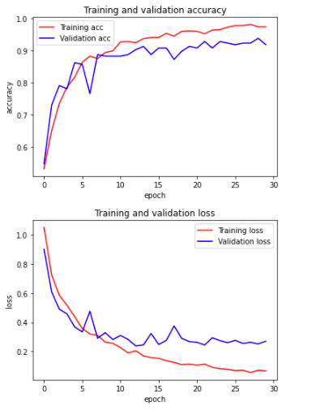
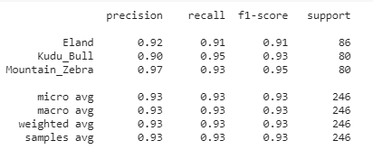
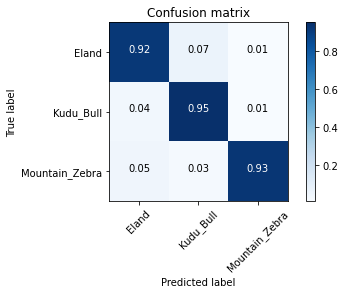
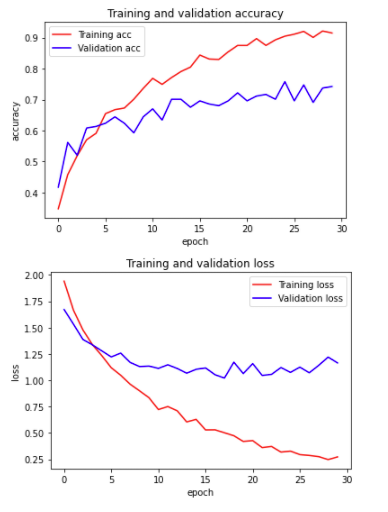
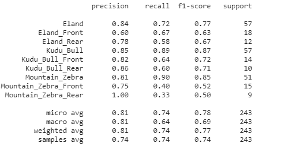
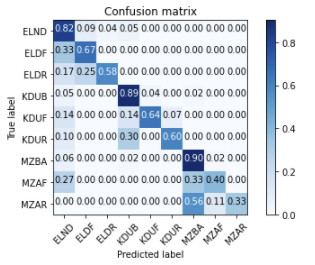

## Using QGIS and Support Vector Machines to Differentiate Species of Meadow Jumping Mice (*Zapus hudsonius*) and Western Jumping Mice (*Zapus princeps*)
**Matthew Clark**

**Introduction**

Colorado is home to two different jumping mouse species, the meadow jumping mouse (*Zapus hudsonius*) and the western jumping mouse (*Zapus princeps*). Many of the subspecies of meadow jumping mice including the Preble's meadow jumping mouse (*Zapus hudsonius preblei*) are listed as endangered (US Fish and Wildlife Service, 2021). Conservation plans for construction along the Front Range frequently have to include plans to avoid or minimize negative effects on the jumping mice. In contrast, the western jumping mouse is thriving. This project will look into whether habitat differences between the two species can be classified by a machine learning algorithm. This will take the form of a support vector machine learner. The goal of the project is to specifically see if the habitat characteristics of meadow jumping mouse habitat can be detected by the SVM. For this reason, the sightings of meadow  jumping mice and western jumping mice will be compared to see if the model can tell the differences between them. The US Fish and Wildlife Service recommends that habitat for the Preble's meadow jumping mouse be within 110 meters of a water body, be it a stream, river, pond or lake (Trainor et. al. 2012). However, Trainor et. al. (2012) have found that some mice can be found as far as 340 meters from a body of water as the mice also frequent the grasslands in the vacinity of rivers. These parameters would be important in this project. 

**Data Sources**

Data was acquired from BISON (Biodiversity Information Serving Our Nation) in the form of point shapefiles containing data on the geographic location of the specimens, the institutions who collected the data, taxonomic information and the date in which it was collected (BISON, n.d.). All data points before 1990 were excluded as the areas where this data was found may have been developed by the present day. In addition the data was clipped to just include data points from Colorado. Institutions who contributed to the data include the Denver Museum of Nature and Science, NatureServe Network, the Museum of Southwestern Biology, Fort Hayes Sternberg Museum of Natural History, University of Alaska Museum of the North, iNaturalist.org, Angelo State Natural History Museum, Charles R. Conner Museum and the University of Colorado Museum of Natural History.

Data for land cover was retrieved from the US Geological Survey's *2011 National Land Cover Dataset* or NLDS 2011 (United States Geological Survey, 2011). This dataset contains 20 different land cover types. This study included open water, open space, developed areas (low, medium and high), barren ground, deciduous forests, coniferous forests, mixed forests, shrubs, grasslands, pasture, agricultural areas, wooded wetlands and herbaceous emergent grasslands. Data for rivers was acquired from the USGS National Geospatial Program's map, *NHD 20200615 for Colorado State or Territory SDshapefile Model Version 2.2.1* (US Geological Survey, 2020). Elevation data was collected from a dataset created by ColoradoView/UV-B Monitoring and Research (n.d.). This dataset consisted of 28 separate raster files representing a digital elevation model (DEM) for the state of Colorado.

**QGIS**

QGIS software was used to process the data needed for the project. This is the key way in which this project was different from others in that data was not collected via an API, but rather by combining external data sources using GIS software. QGIS is an open source software in comparison to ArcGIS which is very expensive. QGIS allowed the data to be processed remotely without an expensive subscription to ArcGIS. At the beginning of the project, a proof-of-concept model was created to see if it was indeed possible to create the required data on QGIS. 

All data needed to be converted to the North America Lambert Conformal Conic projection to ensure that the data was able to line up and overlap properly. A dataset of Colorado Counties was used as a mask to clip the 2011 National Land Cover Database (NLDS 2011) to just Colorado. In the case of the proof-of-concept model, this was just to Douglas County. The river data from the USGS was clipped to just include Colorado counties, as it previously included the entire watersheds in the region around Colorado. This data was composed not just of major rivers, but also the flowlines in each direction (North, South, East, Northeast, Southeast, West, Northwest and Southwest). In order to calculate the distance from streams required this data to be merged. This data was then transformed into a raster using the *rasterize* function. The finest resolution possible was a 10-square meter resolution. Distances from rivers were then calculated using 10-square meter increments using the *proximity* function.

The BISON data included sightings of both the western and meadow jumping mice, and these shapefiles needed to be converted to the Lambert Conformal Conic coordinate system and then combined using the *merge* function. Because the datasets all contained the same columns, this was actually very easy. Buffers were calculated at a distance of  340-meters as per the observations of Trainor et. al. 2012. The *zonal histogram* function was then used to perform a count of the number of pixels in each land cover type that overlapped with each buffer polygon. These values came from approximately 28 square-meter cells that would later be multiplied by 28 with Pandas to produce the area in square-meters of each habitat type within each buffer. The *zonal statistics* function was used to find the average distance value in 10x10 square meter pixels from a river within each buffer. This value would later be multiplied by 10 to estimate the average distance in square meters from rivers within the buffer. The zonal statistics function would also perform a similar operation to determine the average elevation in meters within each buffer.


### Modules used in this project

**Pandas**

**numpy**

**seaborn**

**numpy**

**IPython**

**Matplotlib**

**sklearn**
sklearn functions include train_test_split, accuracy_score, svm, metrics, cross_val_score, DecisionTreeClassifier, FactorAnalysis

**Preparing the Data**

Data preparation involved exporting the data from the final data's attribute table as a .csv file, and then using Pandas to edit the data. This involved creating a list of new names for the subsequent columns in the dataset and applying them with the .columns function. As the data was prepared in QGIS, it was not necessary to fill in columns with missing data. Lambda functions were then used to further edit the data. Some points fell outside of the scope of the NLCD and had a value of NoData in some or all of their buffers. To fix this problem, these cells were multiplied by zero in the lambda functions so that this column would not interfere with data analysis. Each column for land cover in the NLCD had counts of approximately 28 square meter cells, so each column needed to be multiplied by 28. The finest resolution possible for the distance from rivers were 10 square meter cells, so the values in this column needed to be multiplied by 10. 


<div>
</style>
<table border="1" class="dataframe">
  <thead>
    <tr style="text-align: right;">
      <th></th>
      <th>fid</th>
      <th>bisonID</th>
      <th>ITISsciNme</th>
      <th>xcoord</th>
      <th>ycoord</th>
      <th>nlcdb2011_0</th>
      <th>nlcdb2011_11</th>
      <th>nlcdb2011_21</th>
      <th>nlcdb2011_22</th>
      <th>nlcdb2011_23</th>
      <th>...</th>
      <th>nlcdb2011_42</th>
      <th>nlcdb2011_43</th>
      <th>nlcdb2011_52</th>
      <th>nlcdb2011_71</th>
      <th>nlcdb2011_81</th>
      <th>nlcdb2011_82</th>
      <th>nlcdb2011_90</th>
      <th>nlcdb2011_95</th>
      <th>riverdist_decameters_mean</th>
      <th>Ele_meters_mean</th>
    </tr>
  </thead>
  <tbody>
    <tr>
      <th>0</th>
      <td>1</td>
      <td>1061284029</td>
      <td>Zapus princeps</td>
      <td>-1.048927e+06</td>
      <td>34400.810906</td>
      <td>0</td>
      <td>0</td>
      <td>0</td>
      <td>0</td>
      <td>0</td>
      <td>...</td>
      <td>263</td>
      <td>0</td>
      <td>36</td>
      <td>0</td>
      <td>0</td>
      <td>0</td>
      <td>0</td>
      <td>0</td>
      <td>18.462810</td>
      <td>0.000000</td>
    </tr>
    <tr>
      <th>1</th>
      <td>2</td>
      <td>897076990</td>
      <td>Zapus princeps</td>
      <td>-8.852860e+05</td>
      <td>161407.789815</td>
      <td>9</td>
      <td>0</td>
      <td>0</td>
      <td>0</td>
      <td>0</td>
      <td>...</td>
      <td>12</td>
      <td>0</td>
      <td>116</td>
      <td>0</td>
      <td>132</td>
      <td>0</td>
      <td>87</td>
      <td>0</td>
      <td>13.076882</td>
      <td>1362.505689</td>
    </tr>
    <tr>
      <th>2</th>
      <td>3</td>
      <td>897077009</td>
      <td>Zapus princeps</td>
      <td>-8.852860e+05</td>
      <td>161407.789815</td>
      <td>9</td>
      <td>0</td>
      <td>0</td>
      <td>0</td>
      <td>0</td>
      <td>...</td>
      <td>12</td>
      <td>0</td>
      <td>116</td>
      <td>0</td>
      <td>132</td>
      <td>0</td>
      <td>87</td>
      <td>0</td>
      <td>13.076882</td>
      <td>1362.505689</td>
    </tr>
    <tr>
      <th>3</th>
      <td>4</td>
      <td>897077028</td>
      <td>Zapus princeps</td>
      <td>-8.852860e+05</td>
      <td>161407.789815</td>
      <td>9</td>
      <td>0</td>
      <td>0</td>
      <td>0</td>
      <td>0</td>
      <td>...</td>
      <td>12</td>
      <td>0</td>
      <td>116</td>
      <td>0</td>
      <td>132</td>
      <td>0</td>
      <td>87</td>
      <td>0</td>
      <td>13.076882</td>
      <td>1362.505689</td>
    </tr>
    <tr>
      <th>4</th>
      <td>5</td>
      <td>1837315390</td>
      <td>Zapus princeps</td>
      <td>-8.850253e+05</td>
      <td>161374.025382</td>
      <td>7</td>
      <td>0</td>
      <td>0</td>
      <td>0</td>
      <td>0</td>
      <td>...</td>
      <td>22</td>
      <td>0</td>
      <td>187</td>
      <td>0</td>
      <td>54</td>
      <td>0</td>
      <td>83</td>
      <td>0</td>
      <td>20.020843</td>
      <td>1372.888781</td>
    </tr>
    <tr>
      <th>...</th>
      <td>...</td>
      <td>...</td>
      <td>...</td>
      <td>...</td>
      <td>...</td>
      <td>...</td>
      <td>...</td>
      <td>...</td>
      <td>...</td>
      <td>...</td>
      <td>...</td>
      <td>...</td>
      <td>...</td>
      <td>...</td>
      <td>...</td>
      <td>...</td>
      <td>...</td>
      <td>...</td>
      <td>...</td>
      <td>...</td>
      <td>...</td>
    </tr>
    <tr>
      <th>397</th>
      <td>398</td>
      <td>1145109121</td>
      <td>Zapus hudsonius</td>
      <td>-7.269401e+05</td>
      <td>-19090.725997</td>
      <td>0</td>
      <td>0</td>
      <td>36</td>
      <td>0</td>
      <td>0</td>
      <td>...</td>
      <td>0</td>
      <td>0</td>
      <td>96</td>
      <td>247</td>
      <td>0</td>
      <td>0</td>
      <td>58</td>
      <td>0</td>
      <td>13.668359</td>
      <td>1761.247582</td>
    </tr>
    <tr>
      <th>398</th>
      <td>399</td>
      <td>1145109130</td>
      <td>Zapus hudsonius</td>
      <td>-7.269401e+05</td>
      <td>-19090.725997</td>
      <td>0</td>
      <td>0</td>
      <td>36</td>
      <td>0</td>
      <td>0</td>
      <td>...</td>
      <td>0</td>
      <td>0</td>
      <td>96</td>
      <td>247</td>
      <td>0</td>
      <td>0</td>
      <td>58</td>
      <td>0</td>
      <td>13.668359</td>
      <td>1761.247582</td>
    </tr>
    <tr>
      <th>399</th>
      <td>400</td>
      <td>1145109134</td>
      <td>Zapus hudsonius</td>
      <td>-7.269401e+05</td>
      <td>-19090.725997</td>
      <td>0</td>
      <td>0</td>
      <td>36</td>
      <td>0</td>
      <td>0</td>
      <td>...</td>
      <td>0</td>
      <td>0</td>
      <td>96</td>
      <td>247</td>
      <td>0</td>
      <td>0</td>
      <td>58</td>
      <td>0</td>
      <td>13.668359</td>
      <td>1761.247582</td>
    </tr>
    <tr>
      <th>400</th>
      <td>401</td>
      <td>1145109154</td>
      <td>Zapus hudsonius</td>
      <td>-7.269401e+05</td>
      <td>-19090.725997</td>
      <td>0</td>
      <td>0</td>
      <td>36</td>
      <td>0</td>
      <td>0</td>
      <td>...</td>
      <td>0</td>
      <td>0</td>
      <td>96</td>
      <td>247</td>
      <td>0</td>
      <td>0</td>
      <td>58</td>
      <td>0</td>
      <td>13.668359</td>
      <td>1761.247582</td>
    </tr>
    <tr>
      <th>401</th>
      <td>402</td>
      <td>1145109161</td>
      <td>Zapus hudsonius</td>
      <td>-7.269401e+05</td>
      <td>-19090.725997</td>
      <td>0</td>
      <td>0</td>
      <td>36</td>
      <td>0</td>
      <td>0</td>
      <td>...</td>
      <td>0</td>
      <td>0</td>
      <td>96</td>
      <td>247</td>
      <td>0</td>
      <td>0</td>
      <td>58</td>
      <td>0</td>
      <td>13.668359</td>
      <td>1761.247582</td>
    </tr>
  </tbody>
</table>
<p>402 rows × 23 columns</p>
</div>

<div>
</style>
<table border="1" class="dataframe">
  <thead>
    <tr style="text-align: right;">
      <th></th>
      <th>fid</th>
      <th>bisonID</th>
      <th>Species</th>
      <th>xcoord</th>
      <th>ycoord</th>
      <th>NoData</th>
      <th>Open_water</th>
      <th>Dev_open_space</th>
      <th>Dev_low</th>
      <th>Dev_medium</th>
      <th>...</th>
      <th>Conifer_forest</th>
      <th>Mixed_forest</th>
      <th>Shrubland</th>
      <th>Grassland</th>
      <th>Pasture</th>
      <th>Agriculture</th>
      <th>Wetlands_woody</th>
      <th>Wetlands_herb</th>
      <th>River_Distance</th>
      <th>Elevation</th>
    </tr>
  </thead>
  <tbody>
    <tr>
      <th>0</th>
      <td>1</td>
      <td>1061284029</td>
      <td>Zapus princeps</td>
      <td>-1.048927e+06</td>
      <td>34400.810906</td>
      <td>0</td>
      <td>0</td>
      <td>0</td>
      <td>0</td>
      <td>0</td>
      <td>...</td>
      <td>263</td>
      <td>0</td>
      <td>36</td>
      <td>0</td>
      <td>0</td>
      <td>0</td>
      <td>0</td>
      <td>0</td>
      <td>18.462810</td>
      <td>0.000000</td>
    </tr>
    <tr>
      <th>1</th>
      <td>2</td>
      <td>897076990</td>
      <td>Zapus princeps</td>
      <td>-8.852860e+05</td>
      <td>161407.789815</td>
      <td>9</td>
      <td>0</td>
      <td>0</td>
      <td>0</td>
      <td>0</td>
      <td>...</td>
      <td>12</td>
      <td>0</td>
      <td>116</td>
      <td>0</td>
      <td>132</td>
      <td>0</td>
      <td>87</td>
      <td>0</td>
      <td>13.076882</td>
      <td>1362.505689</td>
    </tr>
    <tr>
      <th>2</th>
      <td>3</td>
      <td>897077009</td>
      <td>Zapus princeps</td>
      <td>-8.852860e+05</td>
      <td>161407.789815</td>
      <td>9</td>
      <td>0</td>
      <td>0</td>
      <td>0</td>
      <td>0</td>
      <td>...</td>
      <td>12</td>
      <td>0</td>
      <td>116</td>
      <td>0</td>
      <td>132</td>
      <td>0</td>
      <td>87</td>
      <td>0</td>
      <td>13.076882</td>
      <td>1362.505689</td>
    </tr>
    <tr>
      <th>3</th>
      <td>4</td>
      <td>897077028</td>
      <td>Zapus princeps</td>
      <td>-8.852860e+05</td>
      <td>161407.789815</td>
      <td>9</td>
      <td>0</td>
      <td>0</td>
      <td>0</td>
      <td>0</td>
      <td>...</td>
      <td>12</td>
      <td>0</td>
      <td>116</td>
      <td>0</td>
      <td>132</td>
      <td>0</td>
      <td>87</td>
      <td>0</td>
      <td>13.076882</td>
      <td>1362.505689</td>
    </tr>
    <tr>
      <th>4</th>
      <td>5</td>
      <td>1837315390</td>
      <td>Zapus princeps</td>
      <td>-8.850253e+05</td>
      <td>161374.025382</td>
      <td>7</td>
      <td>0</td>
      <td>0</td>
      <td>0</td>
      <td>0</td>
      <td>...</td>
      <td>22</td>
      <td>0</td>
      <td>187</td>
      <td>0</td>
      <td>54</td>
      <td>0</td>
      <td>83</td>
      <td>0</td>
      <td>20.020843</td>
      <td>1372.888781</td>
    </tr>
    <tr>
      <th>...</th>
      <td>...</td>
      <td>...</td>
      <td>...</td>
      <td>...</td>
      <td>...</td>
      <td>...</td>
      <td>...</td>
      <td>...</td>
      <td>...</td>
      <td>...</td>
      <td>...</td>
      <td>...</td>
      <td>...</td>
      <td>...</td>
      <td>...</td>
      <td>...</td>
      <td>...</td>
      <td>...</td>
      <td>...</td>
      <td>...</td>
      <td>...</td>
    </tr>
    <tr>
      <th>397</th>
      <td>398</td>
      <td>1145109121</td>
      <td>Zapus hudsonius</td>
      <td>-7.269401e+05</td>
      <td>-19090.725997</td>
      <td>0</td>
      <td>0</td>
      <td>36</td>
      <td>0</td>
      <td>0</td>
      <td>...</td>
      <td>0</td>
      <td>0</td>
      <td>96</td>
      <td>247</td>
      <td>0</td>
      <td>0</td>
      <td>58</td>
      <td>0</td>
      <td>13.668359</td>
      <td>1761.247582</td>
    </tr>
    <tr>
      <th>398</th>
      <td>399</td>
      <td>1145109130</td>
      <td>Zapus hudsonius</td>
      <td>-7.269401e+05</td>
      <td>-19090.725997</td>
      <td>0</td>
      <td>0</td>
      <td>36</td>
      <td>0</td>
      <td>0</td>
      <td>...</td>
      <td>0</td>
      <td>0</td>
      <td>96</td>
      <td>247</td>
      <td>0</td>
      <td>0</td>
      <td>58</td>
      <td>0</td>
      <td>13.668359</td>
      <td>1761.247582</td>
    </tr>
    <tr>
      <th>399</th>
      <td>400</td>
      <td>1145109134</td>
      <td>Zapus hudsonius</td>
      <td>-7.269401e+05</td>
      <td>-19090.725997</td>
      <td>0</td>
      <td>0</td>
      <td>36</td>
      <td>0</td>
      <td>0</td>
      <td>...</td>
      <td>0</td>
      <td>0</td>
      <td>96</td>
      <td>247</td>
      <td>0</td>
      <td>0</td>
      <td>58</td>
      <td>0</td>
      <td>13.668359</td>
      <td>1761.247582</td>
    </tr>
    <tr>
      <th>400</th>
      <td>401</td>
      <td>1145109154</td>
      <td>Zapus hudsonius</td>
      <td>-7.269401e+05</td>
      <td>-19090.725997</td>
      <td>0</td>
      <td>0</td>
      <td>36</td>
      <td>0</td>
      <td>0</td>
      <td>...</td>
      <td>0</td>
      <td>0</td>
      <td>96</td>
      <td>247</td>
      <td>0</td>
      <td>0</td>
      <td>58</td>
      <td>0</td>
      <td>13.668359</td>
      <td>1761.247582</td>
    </tr>
    <tr>
      <th>401</th>
      <td>402</td>
      <td>1145109161</td>
      <td>Zapus hudsonius</td>
      <td>-7.269401e+05</td>
      <td>-19090.725997</td>
      <td>0</td>
      <td>0</td>
      <td>36</td>
      <td>0</td>
      <td>0</td>
      <td>...</td>
      <td>0</td>
      <td>0</td>
      <td>96</td>
      <td>247</td>
      <td>0</td>
      <td>0</td>
      <td>58</td>
      <td>0</td>
      <td>13.668359</td>
      <td>1761.247582</td>
    </tr>
  </tbody>
</table>
<p>402 rows × 23 columns</p>
</div>


<div>
</style>
<table border="1" class="dataframe">
  <thead>
    <tr style="text-align: right;">
      <th></th>
      <th>fid</th>
      <th>bisonID</th>
      <th>Species</th>
      <th>xcoord</th>
      <th>ycoord</th>
      <th>NoData</th>
      <th>Open_water</th>
      <th>Dev_open_space</th>
      <th>Dev_low</th>
      <th>Dev_medium</th>
      <th>...</th>
      <th>Conifer_forest</th>
      <th>Mixed_forest</th>
      <th>Shrubland</th>
      <th>Grassland</th>
      <th>Pasture</th>
      <th>Agriculture</th>
      <th>Wetlands_woody</th>
      <th>Wetlands_herb</th>
      <th>River_Distance</th>
      <th>Elevation</th>
    </tr>
  </thead>
  <tbody>
    <tr>
      <th>0</th>
      <td>1</td>
      <td>1061284029</td>
      <td>Zapus princeps</td>
      <td>-1.048927e+06</td>
      <td>34400.810906</td>
      <td>0</td>
      <td>0</td>
      <td>0</td>
      <td>0</td>
      <td>0</td>
      <td>...</td>
      <td>7364</td>
      <td>0</td>
      <td>1008</td>
      <td>0</td>
      <td>0</td>
      <td>0</td>
      <td>0</td>
      <td>0</td>
      <td>184.628104</td>
      <td>0.000000</td>
    </tr>
    <tr>
      <th>1</th>
      <td>2</td>
      <td>897076990</td>
      <td>Zapus princeps</td>
      <td>-8.852860e+05</td>
      <td>161407.789815</td>
      <td>0</td>
      <td>0</td>
      <td>0</td>
      <td>0</td>
      <td>0</td>
      <td>...</td>
      <td>336</td>
      <td>0</td>
      <td>3248</td>
      <td>0</td>
      <td>3696</td>
      <td>0</td>
      <td>2436</td>
      <td>0</td>
      <td>130.768821</td>
      <td>1362.505689</td>
    </tr>
    <tr>
      <th>2</th>
      <td>3</td>
      <td>897077009</td>
      <td>Zapus princeps</td>
      <td>-8.852860e+05</td>
      <td>161407.789815</td>
      <td>0</td>
      <td>0</td>
      <td>0</td>
      <td>0</td>
      <td>0</td>
      <td>...</td>
      <td>336</td>
      <td>0</td>
      <td>3248</td>
      <td>0</td>
      <td>3696</td>
      <td>0</td>
      <td>2436</td>
      <td>0</td>
      <td>130.768821</td>
      <td>1362.505689</td>
    </tr>
    <tr>
      <th>3</th>
      <td>4</td>
      <td>897077028</td>
      <td>Zapus princeps</td>
      <td>-8.852860e+05</td>
      <td>161407.789815</td>
      <td>0</td>
      <td>0</td>
      <td>0</td>
      <td>0</td>
      <td>0</td>
      <td>...</td>
      <td>336</td>
      <td>0</td>
      <td>3248</td>
      <td>0</td>
      <td>3696</td>
      <td>0</td>
      <td>2436</td>
      <td>0</td>
      <td>130.768821</td>
      <td>1362.505689</td>
    </tr>
    <tr>
      <th>4</th>
      <td>5</td>
      <td>1837315390</td>
      <td>Zapus princeps</td>
      <td>-8.850253e+05</td>
      <td>161374.025382</td>
      <td>0</td>
      <td>0</td>
      <td>0</td>
      <td>0</td>
      <td>0</td>
      <td>...</td>
      <td>616</td>
      <td>0</td>
      <td>5236</td>
      <td>0</td>
      <td>1512</td>
      <td>0</td>
      <td>2324</td>
      <td>0</td>
      <td>200.208428</td>
      <td>1372.888781</td>
    </tr>
    <tr>
      <th>...</th>
      <td>...</td>
      <td>...</td>
      <td>...</td>
      <td>...</td>
      <td>...</td>
      <td>...</td>
      <td>...</td>
      <td>...</td>
      <td>...</td>
      <td>...</td>
      <td>...</td>
      <td>...</td>
      <td>...</td>
      <td>...</td>
      <td>...</td>
      <td>...</td>
      <td>...</td>
      <td>...</td>
      <td>...</td>
      <td>...</td>
      <td>...</td>
    </tr>
    <tr>
      <th>397</th>
      <td>398</td>
      <td>1145109121</td>
      <td>Zapus hudsonius</td>
      <td>-7.269401e+05</td>
      <td>-19090.725997</td>
      <td>0</td>
      <td>0</td>
      <td>1008</td>
      <td>0</td>
      <td>0</td>
      <td>...</td>
      <td>0</td>
      <td>0</td>
      <td>2688</td>
      <td>6916</td>
      <td>0</td>
      <td>0</td>
      <td>1624</td>
      <td>0</td>
      <td>136.683588</td>
      <td>1761.247582</td>
    </tr>
    <tr>
      <th>398</th>
      <td>399</td>
      <td>1145109130</td>
      <td>Zapus hudsonius</td>
      <td>-7.269401e+05</td>
      <td>-19090.725997</td>
      <td>0</td>
      <td>0</td>
      <td>1008</td>
      <td>0</td>
      <td>0</td>
      <td>...</td>
      <td>0</td>
      <td>0</td>
      <td>2688</td>
      <td>6916</td>
      <td>0</td>
      <td>0</td>
      <td>1624</td>
      <td>0</td>
      <td>136.683588</td>
      <td>1761.247582</td>
    </tr>
    <tr>
      <th>399</th>
      <td>400</td>
      <td>1145109134</td>
      <td>Zapus hudsonius</td>
      <td>-7.269401e+05</td>
      <td>-19090.725997</td>
      <td>0</td>
      <td>0</td>
      <td>1008</td>
      <td>0</td>
      <td>0</td>
      <td>...</td>
      <td>0</td>
      <td>0</td>
      <td>2688</td>
      <td>6916</td>
      <td>0</td>
      <td>0</td>
      <td>1624</td>
      <td>0</td>
      <td>136.683588</td>
      <td>1761.247582</td>
    </tr>
    <tr>
      <th>400</th>
      <td>401</td>
      <td>1145109154</td>
      <td>Zapus hudsonius</td>
      <td>-7.269401e+05</td>
      <td>-19090.725997</td>
      <td>0</td>
      <td>0</td>
      <td>1008</td>
      <td>0</td>
      <td>0</td>
      <td>...</td>
      <td>0</td>
      <td>0</td>
      <td>2688</td>
      <td>6916</td>
      <td>0</td>
      <td>0</td>
      <td>1624</td>
      <td>0</td>
      <td>136.683588</td>
      <td>1761.247582</td>
    </tr>
    <tr>
      <th>401</th>
      <td>402</td>
      <td>1145109161</td>
      <td>Zapus hudsonius</td>
      <td>-7.269401e+05</td>
      <td>-19090.725997</td>
      <td>0</td>
      <td>0</td>
      <td>1008</td>
      <td>0</td>
      <td>0</td>
      <td>...</td>
      <td>0</td>
      <td>0</td>
      <td>2688</td>
      <td>6916</td>
      <td>0</td>
      <td>0</td>
      <td>1624</td>
      <td>0</td>
      <td>136.683588</td>
      <td>1761.247582</td>
    </tr>
  </tbody>
</table>
<p>402 rows × 23 columns</p>
</div>


**Coding for Data Exploration**

Data exploration was done with the Seaborn, Matplotlib and IPython modules. Creating these plots relied on seperating numerical data for land cover types, elevations and river distances using the .iloc[] function from Pandas. The pair plot was created Seaborn's pairplot() function. In contrast, the heat map involved converting the dataframe into an array, and then using Seaborn's heatmap function combined with a corr() function using techniques from Anita (2019). 

<div>
<table border="1" class="dataframe">
  <thead>
    <tr style="text-align: right;">
      <th></th>
      <th>Species</th>
      <th>Dev_open_space</th>
      <th>Dev_low</th>
      <th>Dev_medium</th>
      <th>Dev_high</th>
      <th>Barren_land</th>
      <th>Deci_forest</th>
      <th>Conifer_forest</th>
      <th>Mixed_forest</th>
      <th>Shrubland</th>
      <th>Grassland</th>
      <th>Pasture</th>
      <th>Agriculture</th>
      <th>Wetlands_woody</th>
      <th>Wetlands_herb</th>
    </tr>
  </thead>
  <tbody>
    <tr>
      <th>0</th>
      <td>Zapus princeps</td>
      <td>0</td>
      <td>0</td>
      <td>0</td>
      <td>0</td>
      <td>0</td>
      <td>3948</td>
      <td>7364</td>
      <td>0</td>
      <td>1008</td>
      <td>0</td>
      <td>0</td>
      <td>0</td>
      <td>0</td>
      <td>0</td>
    </tr>
    <tr>
      <th>1</th>
      <td>Zapus princeps</td>
      <td>0</td>
      <td>0</td>
      <td>0</td>
      <td>0</td>
      <td>0</td>
      <td>2156</td>
      <td>336</td>
      <td>0</td>
      <td>3248</td>
      <td>0</td>
      <td>3696</td>
      <td>0</td>
      <td>2436</td>
      <td>0</td>
    </tr>
    <tr>
      <th>2</th>
      <td>Zapus princeps</td>
      <td>0</td>
      <td>0</td>
      <td>0</td>
      <td>0</td>
      <td>0</td>
      <td>2156</td>
      <td>336</td>
      <td>0</td>
      <td>3248</td>
      <td>0</td>
      <td>3696</td>
      <td>0</td>
      <td>2436</td>
      <td>0</td>
    </tr>
    <tr>
      <th>3</th>
      <td>Zapus princeps</td>
      <td>0</td>
      <td>0</td>
      <td>0</td>
      <td>0</td>
      <td>0</td>
      <td>2156</td>
      <td>336</td>
      <td>0</td>
      <td>3248</td>
      <td>0</td>
      <td>3696</td>
      <td>0</td>
      <td>2436</td>
      <td>0</td>
    </tr>
    <tr>
      <th>4</th>
      <td>Zapus princeps</td>
      <td>0</td>
      <td>0</td>
      <td>0</td>
      <td>0</td>
      <td>0</td>
      <td>2324</td>
      <td>616</td>
      <td>0</td>
      <td>5236</td>
      <td>0</td>
      <td>1512</td>
      <td>0</td>
      <td>2324</td>
      <td>0</td>
    </tr>
    <tr>
      <th>...</th>
      <td>...</td>
      <td>...</td>
      <td>...</td>
      <td>...</td>
      <td>...</td>
      <td>...</td>
      <td>...</td>
      <td>...</td>
      <td>...</td>
      <td>...</td>
      <td>...</td>
      <td>...</td>
      <td>...</td>
      <td>...</td>
      <td>...</td>
    </tr>
    <tr>
      <th>397</th>
      <td>Zapus hudsonius</td>
      <td>1008</td>
      <td>0</td>
      <td>0</td>
      <td>0</td>
      <td>0</td>
      <td>0</td>
      <td>0</td>
      <td>0</td>
      <td>2688</td>
      <td>6916</td>
      <td>0</td>
      <td>0</td>
      <td>1624</td>
      <td>0</td>
    </tr>
    <tr>
      <th>398</th>
      <td>Zapus hudsonius</td>
      <td>1008</td>
      <td>0</td>
      <td>0</td>
      <td>0</td>
      <td>0</td>
      <td>0</td>
      <td>0</td>
      <td>0</td>
      <td>2688</td>
      <td>6916</td>
      <td>0</td>
      <td>0</td>
      <td>1624</td>
      <td>0</td>
    </tr>
    <tr>
      <th>399</th>
      <td>Zapus hudsonius</td>
      <td>1008</td>
      <td>0</td>
      <td>0</td>
      <td>0</td>
      <td>0</td>
      <td>0</td>
      <td>0</td>
      <td>0</td>
      <td>2688</td>
      <td>6916</td>
      <td>0</td>
      <td>0</td>
      <td>1624</td>
      <td>0</td>
    </tr>
    <tr>
      <th>400</th>
      <td>Zapus hudsonius</td>
      <td>1008</td>
      <td>0</td>
      <td>0</td>
      <td>0</td>
      <td>0</td>
      <td>0</td>
      <td>0</td>
      <td>0</td>
      <td>2688</td>
      <td>6916</td>
      <td>0</td>
      <td>0</td>
      <td>1624</td>
      <td>0</td>
    </tr>
    <tr>
      <th>401</th>
      <td>Zapus hudsonius</td>
      <td>1008</td>
      <td>0</td>
      <td>0</td>
      <td>0</td>
      <td>0</td>
      <td>0</td>
      <td>0</td>
      <td>0</td>
      <td>2688</td>
      <td>6916</td>
      <td>0</td>
      <td>0</td>
      <td>1624</td>
      <td>0</td>
    </tr>
  </tbody>
</table>
<p>402 rows × 15 columns</p>
</div>


<div>
<table border="1" class="dataframe">
  <thead>
    <tr style="text-align: right;">
      <th></th>
      <th>Open_water</th>
      <th>Dev_open_space</th>
      <th>Dev_low</th>
      <th>Dev_medium</th>
      <th>Dev_high</th>
      <th>Barren_land</th>
      <th>Deci_forest</th>
      <th>Conifer_forest</th>
      <th>Mixed_forest</th>
      <th>Shrubland</th>
      <th>Grassland</th>
      <th>Pasture</th>
      <th>Agriculture</th>
      <th>Wetlands_woody</th>
      <th>Wetlands_herb</th>
      <th>River_Distance</th>
      <th>Elevation</th>
    </tr>
  </thead>
  <tbody>
    <tr>
      <th>0</th>
      <td>0</td>
      <td>0</td>
      <td>0</td>
      <td>0</td>
      <td>0</td>
      <td>0</td>
      <td>3948</td>
      <td>7364</td>
      <td>0</td>
      <td>1008</td>
      <td>0</td>
      <td>0</td>
      <td>0</td>
      <td>0</td>
      <td>0</td>
      <td>184.628104</td>
      <td>0.000000</td>
    </tr>
    <tr>
      <th>1</th>
      <td>0</td>
      <td>0</td>
      <td>0</td>
      <td>0</td>
      <td>0</td>
      <td>0</td>
      <td>2156</td>
      <td>336</td>
      <td>0</td>
      <td>3248</td>
      <td>0</td>
      <td>3696</td>
      <td>0</td>
      <td>2436</td>
      <td>0</td>
      <td>130.768821</td>
      <td>1362.505689</td>
    </tr>
    <tr>
      <th>2</th>
      <td>0</td>
      <td>0</td>
      <td>0</td>
      <td>0</td>
      <td>0</td>
      <td>0</td>
      <td>2156</td>
      <td>336</td>
      <td>0</td>
      <td>3248</td>
      <td>0</td>
      <td>3696</td>
      <td>0</td>
      <td>2436</td>
      <td>0</td>
      <td>130.768821</td>
      <td>1362.505689</td>
    </tr>
    <tr>
      <th>3</th>
      <td>0</td>
      <td>0</td>
      <td>0</td>
      <td>0</td>
      <td>0</td>
      <td>0</td>
      <td>2156</td>
      <td>336</td>
      <td>0</td>
      <td>3248</td>
      <td>0</td>
      <td>3696</td>
      <td>0</td>
      <td>2436</td>
      <td>0</td>
      <td>130.768821</td>
      <td>1362.505689</td>
    </tr>
    <tr>
      <th>4</th>
      <td>0</td>
      <td>0</td>
      <td>0</td>
      <td>0</td>
      <td>0</td>
      <td>0</td>
      <td>2324</td>
      <td>616</td>
      <td>0</td>
      <td>5236</td>
      <td>0</td>
      <td>1512</td>
      <td>0</td>
      <td>2324</td>
      <td>0</td>
      <td>200.208428</td>
      <td>1372.888781</td>
    </tr>
    <tr>
      <th>...</th>
      <td>...</td>
      <td>...</td>
      <td>...</td>
      <td>...</td>
      <td>...</td>
      <td>...</td>
      <td>...</td>
      <td>...</td>
      <td>...</td>
      <td>...</td>
      <td>...</td>
      <td>...</td>
      <td>...</td>
      <td>...</td>
      <td>...</td>
      <td>...</td>
      <td>...</td>
    </tr>
    <tr>
      <th>397</th>
      <td>0</td>
      <td>1008</td>
      <td>0</td>
      <td>0</td>
      <td>0</td>
      <td>0</td>
      <td>0</td>
      <td>0</td>
      <td>0</td>
      <td>2688</td>
      <td>6916</td>
      <td>0</td>
      <td>0</td>
      <td>1624</td>
      <td>0</td>
      <td>136.683588</td>
      <td>1761.247582</td>
    </tr>
    <tr>
      <th>398</th>
      <td>0</td>
      <td>1008</td>
      <td>0</td>
      <td>0</td>
      <td>0</td>
      <td>0</td>
      <td>0</td>
      <td>0</td>
      <td>0</td>
      <td>2688</td>
      <td>6916</td>
      <td>0</td>
      <td>0</td>
      <td>1624</td>
      <td>0</td>
      <td>136.683588</td>
      <td>1761.247582</td>
    </tr>
    <tr>
      <th>399</th>
      <td>0</td>
      <td>1008</td>
      <td>0</td>
      <td>0</td>
      <td>0</td>
      <td>0</td>
      <td>0</td>
      <td>0</td>
      <td>0</td>
      <td>2688</td>
      <td>6916</td>
      <td>0</td>
      <td>0</td>
      <td>1624</td>
      <td>0</td>
      <td>136.683588</td>
      <td>1761.247582</td>
    </tr>
    <tr>
      <th>400</th>
      <td>0</td>
      <td>1008</td>
      <td>0</td>
      <td>0</td>
      <td>0</td>
      <td>0</td>
      <td>0</td>
      <td>0</td>
      <td>0</td>
      <td>2688</td>
      <td>6916</td>
      <td>0</td>
      <td>0</td>
      <td>1624</td>
      <td>0</td>
      <td>136.683588</td>
      <td>1761.247582</td>
    </tr>
    <tr>
      <th>401</th>
      <td>0</td>
      <td>1008</td>
      <td>0</td>
      <td>0</td>
      <td>0</td>
      <td>0</td>
      <td>0</td>
      <td>0</td>
      <td>0</td>
      <td>2688</td>
      <td>6916</td>
      <td>0</td>
      <td>0</td>
      <td>1624</td>
      <td>0</td>
      <td>136.683588</td>
      <td>1761.247582</td>
    </tr>
  </tbody>
</table>
<p>402 rows × 17 columns</p>
</div>


**Results for Data Explortation**

The shear number of variables made interpreting the pairplot difficult. Many variables had skewed distributions due to the high number of zero values. It is hoped that the large sample sizes will be sufficient to balance for this effect. Strong relationships between the different development types were detected in both the correlation matrix with a heatmap and with the pairplot. The heat map in particular showed a strong relationship between open space development and low developed areas, medium development and high development areas and between river distance and grasslands. The final correlation is likely due to the fact that many Preble's jumping mouse sightings were found in grasslands within 320 meters from water, as observed in Trainor et. al. (2012). A correlation between mixed forest and decidous forest was also observed. Coniferous forest correlated heavily in a positive way to elevation and strongly in a negative way to grasslands. This is not surprising as the two habitat types are found at different elevations. 
    

    


    <AxesSubplot:>


    

    


<div>
</style>
<table border="1" class="dataframe">
  <thead>
    <tr style="text-align: right;">
      <th></th>
      <th>Open_water</th>
      <th>Dev_open_space</th>
      <th>Dev_low</th>
      <th>Dev_medium</th>
      <th>Dev_high</th>
      <th>Barren_land</th>
      <th>Deci_forest</th>
      <th>Conifer_forest</th>
      <th>Mixed_forest</th>
      <th>Shrubland</th>
      <th>Grassland</th>
      <th>Pasture</th>
      <th>Agriculture</th>
      <th>Wetlands_woody</th>
      <th>Wetlands_herb</th>
      <th>River_Distance</th>
      <th>Elevation</th>
    </tr>
  </thead>
  <tbody>
    <tr>
      <th>Open_water</th>
      <td>1.000000</td>
      <td>-0.036538</td>
      <td>0.021182</td>
      <td>0.004826</td>
      <td>-0.006283</td>
      <td>0.144318</td>
      <td>-0.018428</td>
      <td>-0.020311</td>
      <td>-0.011812</td>
      <td>-0.080906</td>
      <td>-0.045913</td>
      <td>0.028194</td>
      <td>0.095883</td>
      <td>0.135825</td>
      <td>-0.016493</td>
      <td>-0.056878</td>
      <td>0.042670</td>
    </tr>
    <tr>
      <th>Dev_open_space</th>
      <td>-0.036538</td>
      <td>1.000000</td>
      <td>0.569501</td>
      <td>0.375584</td>
      <td>0.005372</td>
      <td>0.092142</td>
      <td>-0.240566</td>
      <td>-0.154506</td>
      <td>-0.166893</td>
      <td>-0.188156</td>
      <td>-0.055796</td>
      <td>0.069983</td>
      <td>0.062039</td>
      <td>0.216518</td>
      <td>0.440834</td>
      <td>-0.166596</td>
      <td>-0.155284</td>
    </tr>
    <tr>
      <th>Dev_low</th>
      <td>0.021182</td>
      <td>0.569501</td>
      <td>1.000000</td>
      <td>0.679961</td>
      <td>0.145106</td>
      <td>-0.019672</td>
      <td>-0.177684</td>
      <td>-0.250567</td>
      <td>-0.100186</td>
      <td>-0.110592</td>
      <td>-0.061569</td>
      <td>0.009865</td>
      <td>0.235022</td>
      <td>0.081827</td>
      <td>0.390990</td>
      <td>-0.125091</td>
      <td>-0.210519</td>
    </tr>
    <tr>
      <th>Dev_medium</th>
      <td>0.004826</td>
      <td>0.375584</td>
      <td>0.679961</td>
      <td>1.000000</td>
      <td>0.644879</td>
      <td>-0.005309</td>
      <td>-0.135071</td>
      <td>-0.198269</td>
      <td>-0.075286</td>
      <td>-0.132820</td>
      <td>-0.105259</td>
      <td>0.006409</td>
      <td>0.055239</td>
      <td>0.044841</td>
      <td>0.170482</td>
      <td>-0.044876</td>
      <td>-0.150872</td>
    </tr>
    <tr>
      <th>Dev_high</th>
      <td>-0.006283</td>
      <td>0.005372</td>
      <td>0.145106</td>
      <td>0.644879</td>
      <td>1.000000</td>
      <td>-0.010526</td>
      <td>-0.058957</td>
      <td>-0.086835</td>
      <td>-0.029668</td>
      <td>-0.089826</td>
      <td>-0.079595</td>
      <td>-0.025843</td>
      <td>-0.000749</td>
      <td>-0.041685</td>
      <td>-0.030765</td>
      <td>0.023966</td>
      <td>-0.072088</td>
    </tr>
    <tr>
      <th>Barren_land</th>
      <td>0.144318</td>
      <td>0.092142</td>
      <td>-0.019672</td>
      <td>-0.005309</td>
      <td>-0.010526</td>
      <td>1.000000</td>
      <td>-0.035945</td>
      <td>0.050467</td>
      <td>-0.029884</td>
      <td>-0.096226</td>
      <td>-0.048178</td>
      <td>-0.027834</td>
      <td>-0.007122</td>
      <td>-0.009112</td>
      <td>-0.034465</td>
      <td>-0.050859</td>
      <td>0.204099</td>
    </tr>
    <tr>
      <th>Deci_forest</th>
      <td>-0.018428</td>
      <td>-0.240566</td>
      <td>-0.177684</td>
      <td>-0.135071</td>
      <td>-0.058957</td>
      <td>-0.035945</td>
      <td>1.000000</td>
      <td>-0.079970</td>
      <td>0.506314</td>
      <td>-0.080500</td>
      <td>-0.344262</td>
      <td>-0.015278</td>
      <td>-0.036849</td>
      <td>-0.101884</td>
      <td>-0.192160</td>
      <td>-0.211640</td>
      <td>0.290375</td>
    </tr>
    <tr>
      <th>Conifer_forest</th>
      <td>-0.020311</td>
      <td>-0.154506</td>
      <td>-0.250567</td>
      <td>-0.198269</td>
      <td>-0.086835</td>
      <td>0.050467</td>
      <td>-0.079970</td>
      <td>1.000000</td>
      <td>0.046850</td>
      <td>-0.105764</td>
      <td>-0.546043</td>
      <td>-0.135393</td>
      <td>-0.056068</td>
      <td>-0.067948</td>
      <td>-0.283852</td>
      <td>-0.167159</td>
      <td>0.515689</td>
    </tr>
    <tr>
      <th>Mixed_forest</th>
      <td>-0.011812</td>
      <td>-0.166893</td>
      <td>-0.100186</td>
      <td>-0.075286</td>
      <td>-0.029668</td>
      <td>-0.029884</td>
      <td>0.506314</td>
      <td>0.046850</td>
      <td>1.000000</td>
      <td>-0.188500</td>
      <td>-0.229213</td>
      <td>0.010897</td>
      <td>-0.018883</td>
      <td>-0.091582</td>
      <td>-0.096215</td>
      <td>-0.123846</td>
      <td>0.236488</td>
    </tr>
    <tr>
      <th>Shrubland</th>
      <td>-0.080906</td>
      <td>-0.188156</td>
      <td>-0.110592</td>
      <td>-0.132820</td>
      <td>-0.089826</td>
      <td>-0.096226</td>
      <td>-0.080500</td>
      <td>-0.105764</td>
      <td>-0.188500</td>
      <td>1.000000</td>
      <td>-0.289694</td>
      <td>-0.073769</td>
      <td>-0.058049</td>
      <td>-0.199858</td>
      <td>-0.132898</td>
      <td>-0.380409</td>
      <td>-0.333746</td>
    </tr>
    <tr>
      <th>Grassland</th>
      <td>-0.045913</td>
      <td>-0.055796</td>
      <td>-0.061569</td>
      <td>-0.105259</td>
      <td>-0.079595</td>
      <td>-0.048178</td>
      <td>-0.344262</td>
      <td>-0.546043</td>
      <td>-0.229213</td>
      <td>-0.289694</td>
      <td>1.000000</td>
      <td>-0.182204</td>
      <td>-0.030132</td>
      <td>-0.168646</td>
      <td>0.119018</td>
      <td>0.680129</td>
      <td>-0.261759</td>
    </tr>
    <tr>
      <th>Pasture</th>
      <td>0.028194</td>
      <td>0.069983</td>
      <td>0.009865</td>
      <td>0.006409</td>
      <td>-0.025843</td>
      <td>-0.027834</td>
      <td>-0.015278</td>
      <td>-0.135393</td>
      <td>0.010897</td>
      <td>-0.073769</td>
      <td>-0.182204</td>
      <td>1.000000</td>
      <td>-0.008852</td>
      <td>0.304479</td>
      <td>-0.016719</td>
      <td>-0.094673</td>
      <td>-0.129430</td>
    </tr>
    <tr>
      <th>Agriculture</th>
      <td>0.095883</td>
      <td>0.062039</td>
      <td>0.235022</td>
      <td>0.055239</td>
      <td>-0.000749</td>
      <td>-0.007122</td>
      <td>-0.036849</td>
      <td>-0.056068</td>
      <td>-0.018883</td>
      <td>-0.058049</td>
      <td>-0.030132</td>
      <td>-0.008852</td>
      <td>1.000000</td>
      <td>0.172482</td>
      <td>0.010176</td>
      <td>-0.041043</td>
      <td>-0.076413</td>
    </tr>
    <tr>
      <th>Wetlands_woody</th>
      <td>0.135825</td>
      <td>0.216518</td>
      <td>0.081827</td>
      <td>0.044841</td>
      <td>-0.041685</td>
      <td>-0.009112</td>
      <td>-0.101884</td>
      <td>-0.067948</td>
      <td>-0.091582</td>
      <td>-0.199858</td>
      <td>-0.168646</td>
      <td>0.304479</td>
      <td>0.172482</td>
      <td>1.000000</td>
      <td>0.161338</td>
      <td>-0.203844</td>
      <td>-0.079098</td>
    </tr>
    <tr>
      <th>Wetlands_herb</th>
      <td>-0.016493</td>
      <td>0.440834</td>
      <td>0.390990</td>
      <td>0.170482</td>
      <td>-0.030765</td>
      <td>-0.034465</td>
      <td>-0.192160</td>
      <td>-0.283852</td>
      <td>-0.096215</td>
      <td>-0.132898</td>
      <td>0.119018</td>
      <td>-0.016719</td>
      <td>0.010176</td>
      <td>0.161338</td>
      <td>1.000000</td>
      <td>-0.185898</td>
      <td>-0.181274</td>
    </tr>
    <tr>
      <th>River_Distance</th>
      <td>-0.056878</td>
      <td>-0.166596</td>
      <td>-0.125091</td>
      <td>-0.044876</td>
      <td>0.023966</td>
      <td>-0.050859</td>
      <td>-0.211640</td>
      <td>-0.167159</td>
      <td>-0.123846</td>
      <td>-0.380409</td>
      <td>0.680129</td>
      <td>-0.094673</td>
      <td>-0.041043</td>
      <td>-0.203844</td>
      <td>-0.185898</td>
      <td>1.000000</td>
      <td>-0.186060</td>
    </tr>
    <tr>
      <th>Elevation</th>
      <td>0.042670</td>
      <td>-0.155284</td>
      <td>-0.210519</td>
      <td>-0.150872</td>
      <td>-0.072088</td>
      <td>0.204099</td>
      <td>0.290375</td>
      <td>0.515689</td>
      <td>0.236488</td>
      <td>-0.333746</td>
      <td>-0.261759</td>
      <td>-0.129430</td>
      <td>-0.076413</td>
      <td>-0.079098</td>
      <td>-0.181274</td>
      <td>-0.186060</td>
      <td>1.000000</td>
    </tr>
  </tbody>
</table>
</div>


**Creating the SVM model and Displaying the Results**

The actual SVM model was created using code from the YouTube channel CMS WisCon (April 30, 2020). This source was chosen because this was the first time I created an SVM using Python, and I was having difficulty creating the model from a Pandas dataframe. The first step involved creating a random seed for the model using numpy's random.seed() function. Then the model was converted to an array using the .values function. Testing and training datasets were created from the original dataframe. The training data including values for the land area in square meters of different habitat types, the distance in rivers in meters and the elevation of the habitat. Latitude and longitude were left out due to the great difference in orders of magnitude of the data. The colunm for species was used for the dependent variable as it contained the species of the mouse included in the data point. The train_test_split() function from sklearn was used to split both the independent variable and the labels for the dependent variable into train and testing sets. The SVC() from sklearn was used to construct the support vector machine. Versions of the SVM were also created with linear, polynomial and radial basis function kernals. The models were fit with the .fit function, and testd using the .predict() function. The accuracy of the model was printed using the accuracy_score() function. The results of the data were displayed with a confusion matrix created from code by website Edpresso (2021) and sklearn's metrics package. These included a confusion matrix (metrics.confusion_matrix) and a classification report with precision, recall, f1-scores and support (metrics.classification_report).  Results from the support vectors machines were graphed in dataframes created using Python and R Tips (2018).

**Generic SVM**

The first model to be tested was a generic SVM model with default settings. The generic SVM model produced an accuracy value of 0.893. Overall, the model had a precision of 0.89 and a recall of 0.88. The model had a precision of 0.90 for meadow jumping mice (*Zapus hudsonius*) and 0.89 for western jumping mice (*Zapus princeps*). There were 8 western jumping mice misclassified as meadow jumping mice (false negatives) and 5 meadow jumping mice misclassified as western jumping mice (false positives). This resulted in a lower recall score for western jumping mice (0.83) in comparison to meadow jumping mice (0.93). The generic SVM model produced a Cohen's kappa score of 0.7712, indicating a good agreement between the predicted values and the true values (Lantz, 2015, pg. 323).   


<div>
</style>
<table border="1" class="dataframe">
  <thead>
    <tr style="text-align: right;">
      <th></th>
      <th>Z.hudsonius</th>
      <th>Z.princeps</th>
    </tr>
  </thead>
  <tbody>
    <tr>
      <th>0</th>
      <td>69</td>
      <td>5</td>
    </tr>
    <tr>
      <th>1</th>
      <td>8</td>
      <td>39</td>
    </tr>
  </tbody>
</table>
</div>


<div>
<table border="1" class="dataframe">
  <thead>
    <tr style="text-align: right;">
      <th></th>
      <th>Metric</th>
      <th>macro_avg</th>
    </tr>
  </thead>
  <tbody>
    <tr>
      <th>0</th>
      <td>Accuracy</td>
      <td>0.893</td>
    </tr>
    <tr>
      <th>1</th>
      <td>Precision</td>
      <td>0.890</td>
    </tr>
    <tr>
      <th>2</th>
      <td>Recall</td>
      <td>0.880</td>
    </tr>
    <tr>
      <th>3</th>
      <td>f1-score</td>
      <td>0.890</td>
    </tr>
    <tr>
      <th>4</th>
      <td>Kappa</td>
      <td>0.770</td>
    </tr>
  </tbody>
</table>
</div>


**Linear Kernel SVM**

The SVM with a linear kernel produced a considerably lower accuracy with a value of 0.71. This model produced a precision value of 0.73 and a recall value. This model misclassified 28 meadow jumping mice as western jumping mice, and 7 western jumping mice as meadow jumping mice. The model had a precision value of 0.87 for meadow jumping mice and a value of 0.59 for western jumping mice. This model produced a recall value of 0.62 for meadow jumping mice and a value of 0.85 for western jumping mice. The linear SVM model produced a Cohen's kappa score of 0.4371, indicating only a moderate agreement between the predicted values and the true values (Lantz, 2015, pg. 323).  

<div>
<table border="1" class="dataframe">
  <thead>
    <tr style="text-align: right;">
      <th></th>
      <th>Z.hudsonius</th>
      <th>Z.princeps</th>
    </tr>
  </thead>
  <tbody>
    <tr>
      <th>0</th>
      <td>46</td>
      <td>28</td>
    </tr>
    <tr>
      <th>1</th>
      <td>7</td>
      <td>40</td>
    </tr>
  </tbody>
</table>
</div>


<div>
<table border="1" class="dataframe">
  <thead>
    <tr style="text-align: right;">
      <th></th>
      <th>Metric</th>
      <th>macro_avg</th>
    </tr>
  </thead>
  <tbody>
    <tr>
      <th>0</th>
      <td>Accuracy</td>
      <td>0.711</td>
    </tr>
    <tr>
      <th>1</th>
      <td>Precision</td>
      <td>0.730</td>
    </tr>
    <tr>
      <th>2</th>
      <td>Recall</td>
      <td>0.740</td>
    </tr>
    <tr>
      <th>3</th>
      <td>f1-score</td>
      <td>0.710</td>
    </tr>
    <tr>
      <th>4</th>
      <td>Kappa</td>
      <td>0.437</td>
    </tr>
  </tbody>
</table>
</div>


**Polynomial Kernel SVM**

The SVM with a polynomial kernel produced an accuracy of 0.893, a precision value of 0.92 and a recall of 0.87. The model produced a precision of 0.86 for meadow jumping mice and a precision of 0.97 for western jumping mice. Recall values were 0.99 for meadow jumping mice and 0.74. This model misclassified 12 western jumping mice as meadow jumping mice and 1 meadow jumping mouse as a western jumping mouse. The polynomial SVM model produced a Cohen's kappa score of 0.7638, indicating a good agreement between the predicted values and the true values (Lantz, 2015, pg. 323).   
   
<div>
<table border="1" class="dataframe">
  <thead>
    <tr style="text-align: right;">
      <th></th>
      <th>Z.hudsonius</th>
      <th>Z.princeps</th>
    </tr>
  </thead>
  <tbody>
    <tr>
      <th>0</th>
      <td>73</td>
      <td>1</td>
    </tr>
    <tr>
      <th>1</th>
      <td>12</td>
      <td>35</td>
    </tr>
  </tbody>
</table>
</div>


<div>
<style scoped>
    .dataframe tbody tr th:only-of-type {
        vertical-align: middle;
    }

    .dataframe tbody tr th {
        vertical-align: top;
    }

    .dataframe thead th {
        text-align: right;
    }
</style>
<table border="1" class="dataframe">
  <thead>
    <tr style="text-align: right;">
      <th></th>
      <th>Metric</th>
      <th>macro_avg</th>
    </tr>
  </thead>
  <tbody>
    <tr>
      <th>0</th>
      <td>Accuracy</td>
      <td>0.893</td>
    </tr>
    <tr>
      <th>1</th>
      <td>Precision</td>
      <td>0.920</td>
    </tr>
    <tr>
      <th>2</th>
      <td>Recall</td>
      <td>0.870</td>
    </tr>
    <tr>
      <th>3</th>
      <td>f1-score</td>
      <td>0.880</td>
    </tr>
    <tr>
      <th>4</th>
      <td>kappa</td>
      <td>0.764</td>
    </tr>
  </tbody>
</table>
</div>


**SVM with a Radial Basis Function**

This model produced an accuracy of 0.893, and an average precision of 0.89, and an average weighted precision of 0.88. Precision values for meadow jumping mice are 0.90 and western jumping mice are 0.89. Recall values were 0.93 for meadow jumping mice and 0.83 for western jumping mice. This model misclassified 8 western jumping mice as meadow jumping mice, and it misclassified 5 meadow jumping mice as western jumping mice. The radial-basis SVM model produced a Cohen's kappa score of 0.7712, indicating a good agreement between the predicted values and the true values (Lantz, 2015, pg. 323).  

<div>
<table border="1" class="dataframe">
  <thead>
    <tr style="text-align: right;">
      <th></th>
      <th>Z.hudsonius</th>
      <th>Z.princeps</th>
    </tr>
  </thead>
  <tbody>
    <tr>
      <th>0</th>
      <td>69</td>
      <td>5</td>
    </tr>
    <tr>
      <th>1</th>
      <td>8</td>
      <td>39</td>
    </tr>
  </tbody>
</table>
</div>

<div>
<table border="1" class="dataframe">
  <thead>
    <tr style="text-align: right;">
      <th></th>
      <th>Metric</th>
      <th>macro_avg</th>
    </tr>
  </thead>
  <tbody>
    <tr>
      <th>0</th>
      <td>Accuracy</td>
      <td>0.893</td>
    </tr>
    <tr>
      <th>1</th>
      <td>Precision</td>
      <td>0.890</td>
    </tr>
    <tr>
      <th>2</th>
      <td>Recall</td>
      <td>0.880</td>
    </tr>
    <tr>
      <th>3</th>
      <td>f1-score</td>
      <td>0.890</td>
    </tr>
    <tr>
      <th>4</th>
      <td>kappa</td>
      <td>0.770</td>
    </tr>
  </tbody>
</table>
</div>


**Removing variables with high correlation from the Model**

This version of the model removed several variables with a high amount of correlation. Low development had a high degree of correlation with medium development. These variables included low development, medium development, mixed forest, elevation and river distance. It turned out that elevation was associated with different habitats, with low elevations being associated with grasslands and high elevations being associated with conifer forests. As a result, elevation was not necessary. Surprisingly grasslands were strongly correlated with river distance as many meadow jumping mouse sightings were located near rivers. 

**Generic SVM with Fewer Variables**

This model used the generic SVM, but dropped the river distance, elevation, low development, medium development and mixed forest variables in an attempt to make a less complicated model. This model ended up producing identical results to the generic model with all attributes intact. Its accuracy was 0.8903, its precision was 0.89 and its recall was 0.88.This model produced a Cohen's kappa score of 0.7712, indicating a good agreement between the predicted values and the true values (Lantz, 2015, pg. 323).  

<div>
<table border="1" class="dataframe">
  <thead>
    <tr style="text-align: right;">
      <th></th>
      <th>Species</th>
      <th>Dev_open_space</th>
      <th>Dev_high</th>
      <th>Barren_land</th>
      <th>Deci_forest</th>
      <th>Conifer_forest</th>
      <th>Shrubland</th>
      <th>Grassland</th>
      <th>Pasture</th>
      <th>Agriculture</th>
      <th>Wetlands_woody</th>
      <th>Wetlands_herb</th>
    </tr>
  </thead>
  <tbody>
    <tr>
      <th>0</th>
      <td>Zapus princeps</td>
      <td>0</td>
      <td>0</td>
      <td>0</td>
      <td>3948</td>
      <td>7364</td>
      <td>1008</td>
      <td>0</td>
      <td>0</td>
      <td>0</td>
      <td>0</td>
      <td>0</td>
    </tr>
    <tr>
      <th>1</th>
      <td>Zapus princeps</td>
      <td>0</td>
      <td>0</td>
      <td>0</td>
      <td>2156</td>
      <td>336</td>
      <td>3248</td>
      <td>0</td>
      <td>3696</td>
      <td>0</td>
      <td>2436</td>
      <td>0</td>
    </tr>
    <tr>
      <th>2</th>
      <td>Zapus princeps</td>
      <td>0</td>
      <td>0</td>
      <td>0</td>
      <td>2156</td>
      <td>336</td>
      <td>3248</td>
      <td>0</td>
      <td>3696</td>
      <td>0</td>
      <td>2436</td>
      <td>0</td>
    </tr>
    <tr>
      <th>3</th>
      <td>Zapus princeps</td>
      <td>0</td>
      <td>0</td>
      <td>0</td>
      <td>2156</td>
      <td>336</td>
      <td>3248</td>
      <td>0</td>
      <td>3696</td>
      <td>0</td>
      <td>2436</td>
      <td>0</td>
    </tr>
    <tr>
      <th>4</th>
      <td>Zapus princeps</td>
      <td>0</td>
      <td>0</td>
      <td>0</td>
      <td>2324</td>
      <td>616</td>
      <td>5236</td>
      <td>0</td>
      <td>1512</td>
      <td>0</td>
      <td>2324</td>
      <td>0</td>
    </tr>
    <tr>
      <th>...</th>
      <td>...</td>
      <td>...</td>
      <td>...</td>
      <td>...</td>
      <td>...</td>
      <td>...</td>
      <td>...</td>
      <td>...</td>
      <td>...</td>
      <td>...</td>
      <td>...</td>
      <td>...</td>
    </tr>
    <tr>
      <th>397</th>
      <td>Zapus hudsonius</td>
      <td>1008</td>
      <td>0</td>
      <td>0</td>
      <td>0</td>
      <td>0</td>
      <td>2688</td>
      <td>6916</td>
      <td>0</td>
      <td>0</td>
      <td>1624</td>
      <td>0</td>
    </tr>
    <tr>
      <th>398</th>
      <td>Zapus hudsonius</td>
      <td>1008</td>
      <td>0</td>
      <td>0</td>
      <td>0</td>
      <td>0</td>
      <td>2688</td>
      <td>6916</td>
      <td>0</td>
      <td>0</td>
      <td>1624</td>
      <td>0</td>
    </tr>
    <tr>
      <th>399</th>
      <td>Zapus hudsonius</td>
      <td>1008</td>
      <td>0</td>
      <td>0</td>
      <td>0</td>
      <td>0</td>
      <td>2688</td>
      <td>6916</td>
      <td>0</td>
      <td>0</td>
      <td>1624</td>
      <td>0</td>
    </tr>
    <tr>
      <th>400</th>
      <td>Zapus hudsonius</td>
      <td>1008</td>
      <td>0</td>
      <td>0</td>
      <td>0</td>
      <td>0</td>
      <td>2688</td>
      <td>6916</td>
      <td>0</td>
      <td>0</td>
      <td>1624</td>
      <td>0</td>
    </tr>
    <tr>
      <th>401</th>
      <td>Zapus hudsonius</td>
      <td>1008</td>
      <td>0</td>
      <td>0</td>
      <td>0</td>
      <td>0</td>
      <td>2688</td>
      <td>6916</td>
      <td>0</td>
      <td>0</td>
      <td>1624</td>
      <td>0</td>
    </tr>
  </tbody>
</table>
<p>402 rows × 12 columns</p>
</div>

<div>
<table border="1" class="dataframe">
  <thead>
    <tr style="text-align: right;">
      <th></th>
      <th>Z.hudsonius</th>
      <th>Z.princeps</th>
    </tr>
  </thead>
  <tbody>
    <tr>
      <th>0</th>
      <td>69</td>
      <td>5</td>
    </tr>
    <tr>
      <th>1</th>
      <td>8</td>
      <td>39</td>
    </tr>
  </tbody>
</table>
</div>

<div>
<style scoped>
    .dataframe tbody tr th:only-of-type {
        vertical-align: middle;
    }

    .dataframe tbody tr th {
        vertical-align: top;
    }

    .dataframe thead th {
        text-align: right;
    }
</style>
<table border="1" class="dataframe">
  <thead>
    <tr style="text-align: right;">
      <th></th>
      <th>Metric</th>
      <th>macro_avg</th>
    </tr>
  </thead>
  <tbody>
    <tr>
      <th>0</th>
      <td>Accuracy</td>
      <td>0.893</td>
    </tr>
    <tr>
      <th>1</th>
      <td>Precision</td>
      <td>0.890</td>
    </tr>
    <tr>
      <th>2</th>
      <td>Recall</td>
      <td>0.880</td>
    </tr>
    <tr>
      <th>3</th>
      <td>f1-score</td>
      <td>0.890</td>
    </tr>
    <tr>
      <th>4</th>
      <td>kappa</td>
      <td>0.771</td>
    </tr>
  </tbody>
</table>
</div>


**Polynomial SVM with Fewer Variables**

This model was similar to the generic SVM with fewer variables, but it used a polynomial kernel. This model misclassified 7 meadow jumping mice as western jumping mice, and it misclassified 9 western jumping mice as meadow jumping mice. The model's total accuracy was 0.868, with a precision value of 0.86 and a recall value of 0.86. The model produced a precision of 0.88 for the meadow jumping mouse and 0.84 for the western jumping mouse. It produced a recall value of 0.91 for the meadow jumping mouse and a recall of 0.81 for the western jumping mouse. The SVM model produced a Cohen's kappa score of 0.720, indicating a good agreement between the predicted values and the true values (Lantz, 2015, pg. 323).  


<div>
<table border="1" class="dataframe">
  <thead>
    <tr style="text-align: right;">
      <th></th>
      <th>Z.hudsonius</th>
      <th>Z.princeps</th>
    </tr>
  </thead>
  <tbody>
    <tr>
      <th>0</th>
      <td>67</td>
      <td>7</td>
    </tr>
    <tr>
      <th>1</th>
      <td>9</td>
      <td>38</td>
    </tr>
  </tbody>
</table>
</div>

<div>
<table border="1" class="dataframe">
  <thead>
    <tr style="text-align: right;">
      <th></th>
      <th>Metric</th>
      <th>macro_avg</th>
    </tr>
  </thead>
  <tbody>
    <tr>
      <th>0</th>
      <td>Accuracy</td>
      <td>0.868</td>
    </tr>
    <tr>
      <th>1</th>
      <td>Precision</td>
      <td>0.860</td>
    </tr>
    <tr>
      <th>2</th>
      <td>Recall</td>
      <td>0.860</td>
    </tr>
    <tr>
      <th>3</th>
      <td>f1-score</td>
      <td>0.860</td>
    </tr>
    <tr>
      <th>4</th>
      <td>kappa</td>
      <td>0.720</td>
    </tr>
  </tbody>
</table>
</div>


**Decision Tree Models**

In addition to the SVM models, a decision tree was also created as these algorithms tend to be good at dealing with unbalanced (Boyle 2019). The actual decision tree model was created using code from Raschka and Mirjalili (2019) pg. 96. The graphic for the decision tree was created using code from Ptonski (2020). 

**Decision Tree**

The final model was a decision tree model with a Gini index and a max depth of 4. This model produced an accuracy of 0.901, with a precision of 0.93 and a recall of 0.90. For meadow jumping mice the model produced a precision of 0.89, a recall of 0.99 and misclassified 1 meadow jumping mouse as a western jumping mouse. For western jumping mice, the model produced a precision of 0.97 and a recall value of 0.81. It misclassified 9 western jumping mice as meadow jumping mice. The decision tree model produced a Cohen's kappa score of 0.820, indicating a good agreement between the predicted values and the true values (Lantz, 2015, pg. 323). Coniferous forests proved to be an important factor in classifying the mice. This makes sense as the western jumping mouse is more likely to be found in coniferous forests. Surprisingly, shrublands and barren land were also important factors in classifying the mice. 

<div>
<table border="1" class="dataframe">
  <thead>
    <tr style="text-align: right;">
      <th></th>
      <th>Z.hudsonius</th>
      <th>Z.princeps</th>
    </tr>
  </thead>
  <tbody>
    <tr>
      <th>0</th>
      <td>73</td>
      <td>1</td>
    </tr>
    <tr>
      <th>1</th>
      <td>9</td>
      <td>38</td>
    </tr>
  </tbody>
</table>
</div>

<div>
<table border="1" class="dataframe">
  <thead>
    <tr style="text-align: right;">
      <th></th>
      <th>Metric</th>
      <th>macro_avg</th>
    </tr>
  </thead>
  <tbody>
    <tr>
      <th>0</th>
      <td>Accuracy</td>
      <td>0.901</td>
    </tr>
    <tr>
      <th>1</th>
      <td>Precision</td>
      <td>0.930</td>
    </tr>
    <tr>
      <th>2</th>
      <td>Recall</td>
      <td>0.900</td>
    </tr>
    <tr>
      <th>3</th>
      <td>f1-score</td>
      <td>0.910</td>
    </tr>
    <tr>
      <th>4</th>
      <td>kappa</td>
      <td>0.820</td>
    </tr>
  </tbody>
</table>
</div>

    

    


### Results

<div>
<table border="1" class="dataframe">
  <thead>
    <tr style="text-align: right;">
      <th></th>
      <th>Model</th>
      <th>True Positives</th>
      <th>False Positives</th>
      <th>False Negatives</th>
      <th>True Negatives</th>
      <th>Accuracy</th>
      <th>Precision</th>
      <th>Recall</th>
      <th>F-1-Score</th>
      <th>Kappa</th>
    </tr>
  </thead>
  <tbody>
    <tr>
      <th>0</th>
      <td>Generic</td>
      <td>69</td>
      <td>8</td>
      <td>5</td>
      <td>39</td>
      <td>0.893</td>
      <td>0.89</td>
      <td>0.88</td>
      <td>0.89</td>
      <td>0.772</td>
    </tr>
    <tr>
      <th>1</th>
      <td>Linear</td>
      <td>46</td>
      <td>7</td>
      <td>28</td>
      <td>40</td>
      <td>0.710</td>
      <td>0.73</td>
      <td>0.74</td>
      <td>0.71</td>
      <td>0.437</td>
    </tr>
    <tr>
      <th>2</th>
      <td>Polynomial</td>
      <td>73</td>
      <td>12</td>
      <td>1</td>
      <td>35</td>
      <td>0.893</td>
      <td>0.92</td>
      <td>0.87</td>
      <td>0.88</td>
      <td>0.764</td>
    </tr>
    <tr>
      <th>3</th>
      <td>Radial-Basis Function</td>
      <td>69</td>
      <td>8</td>
      <td>5</td>
      <td>39</td>
      <td>0.893</td>
      <td>0.89</td>
      <td>0.88</td>
      <td>0.89</td>
      <td>0.771</td>
    </tr>
    <tr>
      <th>4</th>
      <td>Reduced</td>
      <td>69</td>
      <td>8</td>
      <td>5</td>
      <td>39</td>
      <td>0.893</td>
      <td>0.89</td>
      <td>0.88</td>
      <td>0.89</td>
      <td>0.771</td>
    </tr>
    <tr>
      <th>5</th>
      <td>Reduced Polynomial</td>
      <td>67</td>
      <td>9</td>
      <td>7</td>
      <td>38</td>
      <td>0.868</td>
      <td>0.86</td>
      <td>0.86</td>
      <td>0.86</td>
      <td>0.720</td>
    </tr>
    <tr>
      <th>6</th>
      <td>Decision Tree</td>
      <td>73</td>
      <td>9</td>
      <td>1</td>
      <td>38</td>
      <td>0.901</td>
      <td>0.93</td>
      <td>0.90</td>
      <td>0.91</td>
      <td>0.820</td>
    </tr>
  </tbody>
</table>
</div>

<div>
<table border="1" class="dataframe">
  <thead>
    <tr style="text-align: right;">
      <th></th>
      <th>Model</th>
      <th>Precision_hudsonius</th>
      <th>Precision_princeps</th>
      <th>Recall_hudsonius</th>
      <th>Recall_princeps</th>
      <th>F-1-Score_hudsonius</th>
      <th>F-1-Score_princeps</th>
    </tr>
  </thead>
  <tbody>
    <tr>
      <th>0</th>
      <td>Generic SVM</td>
      <td>0.90</td>
      <td>0.89</td>
      <td>0.93</td>
      <td>0.83</td>
      <td>0.91</td>
      <td>0.86</td>
    </tr>
    <tr>
      <th>1</th>
      <td>Linear SVM</td>
      <td>0.87</td>
      <td>0.59</td>
      <td>0.62</td>
      <td>0.85</td>
      <td>0.72</td>
      <td>0.70</td>
    </tr>
    <tr>
      <th>2</th>
      <td>Polynomial SVM</td>
      <td>0.86</td>
      <td>0.97</td>
      <td>0.99</td>
      <td>0.74</td>
      <td>0.92</td>
      <td>0.84</td>
    </tr>
    <tr>
      <th>3</th>
      <td>Radial-Basis Function SVM</td>
      <td>0.90</td>
      <td>0.89</td>
      <td>0.93</td>
      <td>0.83</td>
      <td>0.91</td>
      <td>0.86</td>
    </tr>
    <tr>
      <th>4</th>
      <td>Reduced Generic SVM</td>
      <td>0.90</td>
      <td>0.89</td>
      <td>0.93</td>
      <td>0.83</td>
      <td>0.91</td>
      <td>0.86</td>
    </tr>
    <tr>
      <th>5</th>
      <td>Reduced Polynomial SVM</td>
      <td>0.88</td>
      <td>0.84</td>
      <td>0.91</td>
      <td>0.81</td>
      <td>0.89</td>
      <td>0.83</td>
    </tr>
    <tr>
      <th>6</th>
      <td>Decision Tree</td>
      <td>0.89</td>
      <td>0.97</td>
      <td>0.99</td>
      <td>0.81</td>
      <td>0.94</td>
      <td>0.88</td>
    </tr>
  </tbody>
</table>
</div>


**Comparing Models**

The model with th highest F1-score was the decision tree model with 0.91. The generic SVM, reduced SVM and radial-basis functions all produced values of 0.89. The polynomial model produced a value of 0.88. The model with the lowest F1-score was the linear model with 0.71. The next lowest was the polynomial SVM with a reduced number of variables. This was a value of 0.86.


**Discussion**

Based on F1 scores, the best model was the decision tree model, but generic model, the generic model with reduced variables and the radial-basis function were not far behind with 0.89. Overall there wasn't a large difference between models except for the linear model. The linear model performed the worst with 0.71, which is not surprising considering the data is binomial. When calculating Cohen's Kappa values, the linear model performed the worst, as expected with only a moderate level of agreement (k = 0.4371) (Lantz, 2015, pg. 323). The decision tree model performed the best (k = 0.820), indicating a very good agreement between predicted and actual values. The other models ranged from k-valued of 0.720 (reduced variable polynomial SVM) to 0.7712 (generic SVM, reduced variable SVM and the radial-basis kernel SVM). These models had a good agreement between the predicted and actual values. 

Removing redundant variables had little effect on the overall effectiveness of the model. In fact, it actually produced a slightly poorer performance in the polynomial model (F1 = 0.868). False negatives are more serious in this model as *H. hudsonius* has several threatened subspecies in Colorado. So  classifying an *H. hudsonius* as an *H. princeps* (a false negative) is more serious than classifying an *H. princeps* as an *H. hudsonius* (a false positive). The model's with the fewest number of misclassified meadow jumping mice were the polynomial SVM and the decision tree models with a single misclassified meadow jumping mouse. 

The models in this project had two major issues. The first was that the data was unbalanced, which created problems in classification. Overall, there were considerably fewer data points for western jumping mice, which likely contributed to the higher number of western jumping mice being being misclassified in most models. The other major issue was the small size of the data. In most wildlife biology studies, datasets greater than 30 samples are often considered to be large enough. However, in machine learning this can create issues as most models rely on higher amounts of data. In hindsight, testing the model on species with more data points may have produced better results. 

Several variables did have redundancies. Elevation was strongly correlated with both grasslands and coniferous forests. This makes sense because coniferous forests are found at higher elevations than grasslands. There was also a strong correlation between river distances and grasslands. This makes sense because the meadow jumping mouse is generally found in the wetlands and grasslands found within 340-meters of water (Trainor et. al. 2012). 

**Using K-fold Cross Validation**

K-fold cross validation is frequently used as a technique for dealing with unbalanced data (Boyle 2019). K-fold cross validation was developed from code by scikit-learn developers (2020) and was used on the two reduced models. However, these models were not able to produce higher values for accuracy and F1-values than their counterparts. The most promising of these models was the cross-validated polynomial SVM, which produced a mean accuracy of 0.878 and a mean F1-value of 0.870. Surprisingly the decision tree model with cross-fold validation did not outperform the polynomial SVM. It had an accuracy of 0.876 and an F-1 score of 0.865. 

#### Cross Validation for the SVM with reduced variables and a Polynomial Kernel 


<div>
<table border="1" class="dataframe">
  <thead>
    <tr style="text-align: right;">
      <th></th>
      <th>Model</th>
      <th>mean accuracy</th>
      <th>F-1 Score</th>
    </tr>
  </thead>
  <tbody>
    <tr>
      <th>0</th>
      <td>K-fold SVM</td>
      <td>0.851</td>
      <td>0.843</td>
    </tr>
    <tr>
      <th>1</th>
      <td>K-fold Polynomial SVM</td>
      <td>0.878</td>
      <td>0.870</td>
    </tr>
    <tr>
      <th>2</th>
      <td>K-fold Decision Tree</td>
      <td>0.876</td>
      <td>0.865</td>
    </tr>
  </tbody>
</table>
</div>


**Possible Concerns**

One of the concerns with this model is that it might be good at identifying the meadow jumping mice simply because there are so many samples of them in the data. Nearly all of the models had issues with identifying the western jumping mice with 7-9 of them being misclassified as meadow jumping mice. In the future, this technique should be tested on species with more data points to see if the misclassification issues are real or simply a product of small sample sizes. In addition, techniques such as under-sampling the larger class could be used to try and make the data more balanced between samples. 

**Bibliography**

US Fish and Wildlife Service (January 6th, 2021) Preble’s Meadow Jumping Mouse Retrieved from: https://www.fws.gov/mountain-prairie/es/preblesMeadowJumpingMouse.php

Trainor, Anne M., Shenk, Tanya M. and Wilson, Kenneth R. (2012) Spatial, temporal, and biological factors associated with Prebles meadow jumping mouse (Zapus hudsonius preblei) home range. Journal of Mammalogy. 93(2), pgs. 429-438. Doi: 10.1644/11-MAMM-A-049.1

Python and R Tips (January 10, 2018) How to Create Pandas Dataframe from Multiple Lists? Pandas Tutorial. [Blog] Retrieved from: https://cmdlinetips.com/2018/01/how-to-create-pandas-dataframe-from-multiple-lists/

CMS WisCon(April 30, 2020) SVM Classifier in Python on Real Data Set [YouTube] Retrieved from: https://www.youtube.com/watch?v=Vv5U0kjYebM

Edpresso (2021) How to create a confusion matrix in Python using scikit-learn [Blog] Retrieved from: https://www.educative.io/edpresso/how-to-create-a-confusion-matrix-in-python-using-scikit-learn

Anita, Okoh (August 20th, 2019) Seaborn Heatmaps: 13 Ways to Customize Correlation Matrix Visualizations [Heartbeat] Retrieved from: https://heartbeat.fritz.ai/seaborn-heatmaps-13-ways-to-customize-correlation-matrix-visualizations-f1c49c816f07

scikit-learn developers (2007-2020) 3.1. Cross-validation: evaluating estimator performance. Retrieved from: https://scikit-learn.org/stable/modules/cross_validation.html

Boyle, Tara (February 3rd, 2019) *Dealing with Imbalanced Data: A guide to effectivly handling imbalanced datasets in Python*. [Towards Data Science] Retrieved from: https://towardsdatascience.com/methods-for-dealing-with-imbalanced-data-5b761be45a18

Raschka, Sebastian and Vahid Mirjalili (2019) *Python Machine Learning Third Edition*. Packt Publishing Ltd.

Chen, Daniel y. (2018) *Pandas for Everyone: Python Data Analysis*. Pearson Education, Inc. 

Lantz, Brett () *Machine Learning with R: Second Edition*. Packt Publishing Ltd.

Ptonski, Piotr (June 22, 2020) Visualize a Decision Tree in 4 Ways with Scikit-Learn and Python [mljar] Retrieved from: https://mljar.com/blog/visualize-decision-tree/ 

DMNS Mammal Collection (Arctos). Denver Museum of Nature and Science. Accessed through Biodiversity Information Serving Our Nation (BISON) (n.d.) Zapus hudsonius prebli [Data File] Retrieved from https://bison.usgs.gov/#home on 1/16/2021

NatureServe Network Species Occurrence Data. Accessed through Biodiversity Information Serving Our Nation (BISON) (n.d.) Zapus hudsonius prebli [Data File] Retrieved from https://bison.usgs.gov/#home on 1/16/2021

Museum of Southwestern Biology. Accessed through Biodiversity Information Serving Our Nation (BISON) (n.d.) Zapus hudsonius prebli [Data File] Retrieved from https://bison.usgs.gov/#home on 1/16/2021

Fort Hayes Sternberg Museum of Natural History. Accessed through Biodiversity Information Serving Our Nation (BISON) (n.d.) Zapus hudsonius prebli [Data File] Retrieved from https://bison.usgs.gov/#home on 1/16/2021

University of Alaska Museum of the North. Accessed through Biodiversity Information Serving Our Nation (BISON) (n.d.) Zapus hudsonius prebli [Data File] Retrieved from https://bison.usgs.gov/#home on 1/16/2021 

iNaturalist.org.Accessed through Biodiversity Information Serving Our Nation (BISON) (n.d.) Zapus hudsonius prebli [Data File] Retrieved from https://bison.usgs.gov/#home on 1/16/2021

Angelo State Natural History Museum (ASNHC).Accessed through Biodiversity Information Serving Our Nation (BISON) (n.d.) Zapus hudsonius prebli [Data File] Retrieved from https://bison.usgs.gov/#home on 1/16/2021

Charles R. Conner Museum.Accessed through Biodiversity Information Serving Our Nation (BISON) (n.d.) Zapus hudsonius prebli [Data File] Retrieved from https://bison.usgs.gov/#home on 1/16/2021

University of Colorado Museum of Natural History.Accessed through Biodiversity Information Serving Our Nation (BISON) (n.d.) Zapus hudsonius prebli [Data File] Retrieved from https://bison.usgs.gov/#home on 1/16/2021

US Geological Survey. US Department of the Interior. (2014). National Land Cover Database 2011 (NLCD2011). [Raster]. Multi-Resolution Land Characteristics Consortium (MRLC). Retrieved from https://www.mrlc.gov/nlcd11_data.php on April 4th 2017. 

CDPHE_user_commuity, Colorado Department of Public Health and the Environment (2/19/2018) Colorado County Boundaries [Data File] Retrieved from: https://data-cdphe.opendata.arcgis.com/datasets/colorado-county-boundaries on 1/16/2021

U.S. Geological Survey, National Geospatial Program (06/15/2020) Retrieved from: NHD 20200615 for Colorado State or Territory Shapefile Model Version 2.2.1 [Data File] https://viewer.nationalmap.gov/basic/?basemap=b1&category=nhd&title=NHD%20View#/ on 1/26/2021

ColoradoView/UV-B Monitoring and Research (n.d.) Colorado Digital Elevation Model files - 1 degree: Section 1-1. [Data File] Retrieved from: https://www.coloradoview.org/aerial-imagery/ on 2/06/2021

ColoradoView/UV-B Monitoring and Research (n.d.) Colorado Digital Elevation Model files - 1 degree: Section 1-2. [Data File] Retrieved from: https://www.coloradoview.org/aerial-imagery/ on 2/06/2021

ColoradoView/UV-B Monitoring and Research (n.d.) Colorado Digital Elevation Model files - 1 degree: Section 1-3. [Data File] Retrieved from: https://www.coloradoview.org/aerial-imagery/ on 2/06/2021

ColoradoView/UV-B Monitoring and Research (n.d.) Colorado Digital Elevation Model files - 1 degree: Section 1-4. [Data File] Retrieved from: https://www.coloradoview.org/aerial-imagery/ on 2/06/2021

ColoradoView/UV-B Monitoring and Research (n.d.) Colorado Digital Elevation Model files - 1 degree: Section 1-5. [Data File] Retrieved from: https://www.coloradoview.org/aerial-imagery/ on 2/06/2021

ColoradoView/UV-B Monitoring and Research (n.d.) Colorado Digital Elevation Model files - 1 degree: Section 1-6. [Data File] Retrieved from: https://www.coloradoview.org/aerial-imagery/ on 2/06/2021

ColoradoView/UV-B Monitoring and Research (n.d.) Colorado Digital Elevation Model files - 1 degree: Section 1-7. [Data File] Retrieved from: https://www.coloradoview.org/aerial-imagery/ on 2/06/2021

ColoradoView/UV-B Monitoring and Research (n.d.) Colorado Digital Elevation Model files - 1 degree: Section 2-1. [Data File] Retrieved from: https://www.coloradoview.org/aerial-imagery/ on 2/06/2021

ColoradoView/UV-B Monitoring and Research (n.d.) Colorado Digital Elevation Model files - 1 degree: Section 2-2. [Data File] Retrieved from: https://www.coloradoview.org/aerial-imagery/ on 2/06/2021

ColoradoView/UV-B Monitoring and Research (n.d.) Colorado Digital Elevation Model files - 1 degree: Section 2-3. [Data File] Retrieved from: https://www.coloradoview.org/aerial-imagery/ on 2/06/2021

ColoradoView/UV-B Monitoring and Research (n.d.) Colorado Digital Elevation Model files - 1 degree: Section 2-4. [Data File] Retrieved from: https://www.coloradoview.org/aerial-imagery/ on 2/06/2021

ColoradoView/UV-B Monitoring and Research (n.d.) Colorado Digital Elevation Model files - 1 degree: Section 2-5. [Data File] Retrieved from: https://www.coloradoview.org/aerial-imagery/ on 2/06/2021

ColoradoView/UV-B Monitoring and Research (n.d.) Colorado Digital Elevation Model files - 1 degree: Section 2-6. [Data File] Retrieved from: https://www.coloradoview.org/aerial-imagery/ on 2/06/2021

ColoradoView/UV-B Monitoring and Research (n.d.) Colorado Digital Elevation Model files - 1 degree: Section 2-7. [Data File] Retrieved from: https://www.coloradoview.org/aerial-imagery/ on 2/06/2021

ColoradoView/UV-B Monitoring and Research (n.d.) Colorado Digital Elevation Model files - 1 degree: Section 3-1. [Data File] Retrieved from: https://www.coloradoview.org/aerial-imagery/ on 2/06/2021

ColoradoView/UV-B Monitoring and Research (n.d.) Colorado Digital Elevation Model files - 1 degree: Section 3-2. [Data File] Retrieved from: https://www.coloradoview.org/aerial-imagery/ on 2/06/2021

ColoradoView/UV-B Monitoring and Research (n.d.) Colorado Digital Elevation Model files - 1 degree: Section 3-3. [Data File] Retrieved from: https://www.coloradoview.org/aerial-imagery/ on 2/06/2021

ColoradoView/UV-B Monitoring and Research (n.d.) Colorado Digital Elevation Model files - 1 degree: Section 3-4. [Data File] Retrieved from: https://www.coloradoview.org/aerial-imagery/ on 2/06/2021

ColoradoView/UV-B Monitoring and Research (n.d.) Colorado Digital Elevation Model files - 1 degree: Section 3-5. [Data File] Retrieved from: https://www.coloradoview.org/aerial-imagery/ on 2/06/2021

ColoradoView/UV-B Monitoring and Research (n.d.) Colorado Digital Elevation Model files - 1 degree: Section 3-6. [Data File] Retrieved from: https://www.coloradoview.org/aerial-imagery/ on 2/06/2021

ColoradoView/UV-B Monitoring and Research (n.d.) Colorado Digital Elevation Model files - 1 degree: Section 3-7. [Data File] Retrieved from: https://www.coloradoview.org/aerial-imagery/ on 2/06/2021

ColoradoView/UV-B Monitoring and Research (n.d.) Colorado Digital Elevation Model files - 1 degree: Section 4-1. [Data File] Retrieved from: https://www.coloradoview.org/aerial-imagery/ on 2/06/2021

ColoradoView/UV-B Monitoring and Research (n.d.) Colorado Digital Elevation Model files - 1 degree: Section 4-2. [Data File] Retrieved from: https://www.coloradoview.org/aerial-imagery/ on 2/06/2021

ColoradoView/UV-B Monitoring and Research (n.d.) Colorado Digital Elevation Model files - 1 degree: Section 4-3. [Data File] Retrieved from: https://www.coloradoview.org/aerial-imagery/ on 2/06/2021

ColoradoView/UV-B Monitoring and Research (n.d.) Colorado Digital Elevation Model files - 1 degree: Section 4-4. [Data File] Retrieved from: https://www.coloradoview.org/aerial-imagery/ on 2/06/2021

ColoradoView/UV-B Monitoring and Research (n.d.) Colorado Digital Elevation Model files - 1 degree: Section 4-5. [Data File] Retrieved from: https://www.coloradoview.org/aerial-imagery/ on 2/06/2021

ColoradoView/UV-B Monitoring and Research (n.d.) Colorado Digital Elevation Model files - 1 degree: Section 4-6. [Data File] Retrieved from: https://www.coloradoview.org/aerial-imagery/ on 2/06/2021

ColoradoView/UV-B Monitoring and Research (n.d.) Colorado Digital Elevation Model files - 1 degree: Section 4-7. [Data File] Retrieved from: https://www.coloradoview.org/aerial-imagery/ on 2/06/2021

**SECOND PRACTICUM PROJECT**

**Using Sequential Neural Networks and Transfer Learning to Assess Biodiversity at Karoo National Park, South Africa**

**INTRODUCTION**

Camera traps offer an unprecedented method to gain a large amount of data on wildlife in a noninvasive manner. Camera traps are remotely triggered cameras that use motion sensors to take photos when animals walk by. Camera traps also present a great opportunity for harnessing big data in wildlife biology (Ahumada et. al. 2019). However, a limitation of this type of data is the time needed to identify the animals in the images. This is where convolutional neural networks come in as these machine learning algorithms can quickly identify large numbers of images. 

However, animals do not pose for pictures, and it is possible that the angle of the animal in a photo can affect the ability of the algorithm to identify the animal in question. This includes situations in which the animal is seen from the front or from the rear rather than from the side. In these situations, the same animal can look very different. In addition, sexual dimorphism can be a factor in identifying an animal in a camera trap image. This algorithm will attempt to discover if sexual dimorphism and the position of the animal can affect the ability of a convolutional neural network to identify a species. In addition, it is possible that different keras applications can have greater success than others in correctly classifying the different categories of animal involved with camera trap images.

The goal of this assignment is to determine if the position of the animal and the type of Keras architecture affects the ability of a CNN to identify an animal. Data will be obtained from three datasets, Snapshot Karoo: Season 1, Snapshot Camdeboo: Season 1 and Snapshot Kgalagadi: Season 1. These datasets are part of the Snapshot Safari program and are available through the Labeled Information Library of Alexandria (LILA BC) (n.d.). This lab will look at three categories of South African herbivore, the bull greater kudu (*Tragelaphus strepsiceros*), the cow eland (*Taurotragus oryx*) and mountain zebra (*Equus zebra*). Datasets will include a control dataset, in which all data for each category of antelope will be included in a single file, and an experimental dataset in which the data for each category is separated by front, rear and side views of the animal. The performance of both the control group and the experimental group will be assessed to determine the effectiveness of the algorithm.

In addition, the performance of the CNN on the control and experimental groups will be tested using a sequential neural network with several different Keras applications. These will include the ResNet101 architecture, the MobileNet architecture and the VGG16 architecture. The accuracy of the algorithm in identifying individual categories, a confusion matrix will also be produced to see which categories the algorithm has difficulty identifying. 

This lab will utilize code created by Iftekher Mamum (2019). This code was chosen for its ability to quickly iterate through epochs, its higher accuracy and the ease at which it can create and display a confusion matrix. 

**METHODS:**

The final dataset was not a balanced dataset because most pictures of the animals were of the side view rather than views from the front or the rear. Diagonal animals are hard to classify so an effort was made to use pictures with a clear enough difference in the position of the animal. The dataset ended up having 788 total images. The experimental dataset ended up with fewer images, with 773, and it not clear why this is. Unfortunately, this error was discovered very late in the project’s process and there was not enough time to fix it. In the control dataset, the cow eland had 277 training images, 69 validation images and 86 test images for 432 images total. The bull greater kudu had 257 training images, 64 validation images and 80 test images for 401 images total. The data for the mountain zebra 254 training images, 64 validation images and 80 testing images. The experimental dataset included separate categories for the side, front and rear views of the animal. The side view of the cow eland included 182 training images, 46 validation images and 57 test images for a total of 285 images. The front view of the cow eland had 57 training images, 14 validation images and 18 testing images for a total of 89 images. The rear view of the cow eland had 37 training images, 9 validation images and 12 testing images for a total of 58 images. The side view of the bull greater kudu had 182 training images, 46 validation images and 57 test images for 285 total images. The front view had 46 training images, 11 validation images and 14 testing images for 71 total images. The rear view had 26 training images, 8 validation images and 10 testing images for a total of 44 total images. The mountain zebra’s side view had 165 training images, 41 validation images and 51 testing images for 257 total images. The front view of the mountain zebra had 48 training images 13 validation images and 15 testing images with a total of 75 images. The mountain zebra’s rear view had 28 training images, 7 validation images and 9 testing images. The data was divided by a 64%/16%/20% train/validation/test split using methods from Shah (2017). 

The model created by Iftekher Mamun (2019) resizes the images to a size of 224 by 224 pixels, an image size chose was also to make the model compatible with the VGG16 architecture that would be used by its convolutional neural network. and converts images into a numpy array which is loaded into a bottleneck file for the training, validation and testing data to use. This numpy array is built from the number associated with each pixel in the photo. The data generators then prepare the data for the convolutional network and most importantly create the labels needed for the confusion matrix to work. This is the key difference between Mamun’s code and the code I originally created, as this was the code that finally allowed me to create the labels needed to build the confusion matrix. The matrix needs a set of easily accessible labels to compare the to the model’s predictions. The model does this by converting the numpy array used in the bottleneck file into a categorical variable that can be used for the labels. Basically, it is a set of dummy variables used to create labels for the machine learner. The model was originally designed to run with 7 epochs and a batch size of 50 (Mamun 2019). However, the number of epochs was increased to 30 in this experiment, and the batch size reduced to 10 as the datasets used were smaller than the animal-10 dataset from Kaggle. The architecture used for the project was the VGG16 algorithm.

**Creating the Confusion Matrix**

Like the model originally created for this project, Mamun (2019) used a CNN called a sequential neural network. This used transfer learning to incorporate the VGG16 architecture. The initial layers forming the top of the model was set to false to avoid incorporating it into the model, and the weights were set to ‘imagenet’ as per Mamun (2019). The model flattened the data and included three hidden layers. The first two use a with 100 nodes and the second with 50 nodes, and both use a LeakyRelu activation function. The model incorporates two dropout layers, one with a dropout of 0.5 and one with a dropout of 0.3. A softmax activation function was used on the final hidden layer as it is a classification-based model (Chollet 2018).


**RESULTS**


**Control Validation Accuracy and Loss:**



**Control Summary:** 





The control model ran for 30 epochs and achieved a validation accuracy of 91.88% and a loss of 0.271. Overall, the training and validation accuracy of the model began to plateau around 19 epochs. The testing accuracy for the 93.1% and a loss of 0.3344. The model produced a precision of 0.92 for the eland, 0.90 for the kudu bull and 0.97 for the mountain zebra. Overall, 92% of the images for the eland were classified correctly. 7% of the images were classified as a kudu bull and 1% were classified as a zebra. 95% of the images for the kudu bull were classified correctly, with 4% classified as the eland and 1% classified as a mountain zebra. 93% of the images for the mountain zebra were classified correctly, while 5% were classified as elands and 3% were classified as a bull kudu. 

**Experimental Training and Validation Accuracy**



**Experimental Summary**




The experimental data produced a validation accuracy of 74.23% and a loss of 1.164. This model appeared to plateau in accuracy and loss at around 25 epochs, but this may reflect a local minimum. With the experimental data, the model produced a test accuracy of 78.19% and a loss of 0.8606. For the eland, the model produced a precision of 0.84 for the side view, 0.60 for the rear view and 0.78 for the front view. For the greater kudu bull, the model produced a precision of 0.85 for the side view, 0.82 for the rear view and 0.86 for the front view. For the mountain zebra, the model produced a precision of 0.81 for the side view, 0.75 for the front and 1.00 for the rear.

**Images of the Eland**

The confusion matrix revealed that the algorithm correctly identified the side view of the animal more frequently than the front and rear views. The model correctly identified approximately 82% of the photos for the side view of the of the eland, with 9% being identified as front views of the eland, 4% as rear views of the eland and 5% being identified as a bull kudu. The Model correctly identified 67% of the images of the front view of the eland correctly, with 33% being misidentified as the side view. The rear view of the eland fared even worse with only 58% of the images being correctly identified. 25% of these images were misidentified as the rear view and 17% were misidentified as the side view.

**Images of the Bull Kudu**

The model correctly identified 89% of the photos of the side view of the bull kudu correctly. 5% were misclassified as the side view of an eland, 4% were misclassified as the front view and 2% were misclassified as the side view of a mountain zebra. 64% of the images of the front view of the bull kudu were correctly identified. In contrast, 14% misclassified as the side view of an eland, 14% were misclassified as the side view of the bull kudu and 7% were misclassified as the rear view of the bull kudu. 60% of the images for the rear view of the bull kudu were identified correctly. 30% of these images were misclassified as the side view of the bull kudu and 10% classified as the side view of the eland.

**Images of the Mountain Zebra**

The model correctly identified 90% of the images for the side view of the mountain zebra. 2% were misclassified as the front view of the zebra, 2% were misclassified as the side view of a bull kudu and 6% were misclassified as the side view of an eland. The algorithm particularly struggled with the front and side views of the mountain zebra, achieving an accuracy of 40% for the front and only 33% for the rear. 33% of the images for the front view of the zebra were misclassified as the front view of the zebra while 27% were surprisingly misclassified as the side view of the eland. 56% of the rear view of the zebra were misclassified as the side view of the zebra while 11% were misclassified as the front view.

**DISCUSION AND CONCLUSION**

Overall, the algorithm proved to be much more capable of identifying different animals than predicted, and creating different categories for the different angles of the animal actually decreased the accuracy of the model, with images frequently being misclassified as the wrong angle of the animal. This was particularly true of side views, which never achieved an accuracy above 67% (eland front view) and were as low as 40% (mountain zebra front view) and 33% (mountain zebra rear view). When the model misclassified an image as the wrong species, it was usually as the side view of an eland. This included 27% of the images of the front view of a zebra, 14% of the images of the side view of the bull kudu and 10% of the images of the front view of the bull kudu were misclassified as the side view of an eland.

One of the issues that this experiment had was that the data was very unbalanced and this may have impacted the results. Originally image augmentation was supposed to be used with the model. It would have a rotation range of 40, a width shift of 0.25, a height shift of 0.25, flipped images and zoomed in images. However, this code actually produced a lower accuracy with the control data leading to the assumption that it would not improve the accuracy of the test. However, this failed to consider that the data was highly unbalanced in the control group. In hindsight, the purpose of the experiment was to see if the algorithm improves with the different angles, not to generate the most accuracy algorithm possible. It is highly probable that the small sample sizes for the rear and side views may have contributed to their failure in the algorithm.

**The confusion matrix for the ResNet101 model for the control group.**


**The confusion matrix for the ResNet101 model for the experimental group.**


The ResNet101 architecture benefits from additional hidden layers and can potentially perform better on more complex datasets (Mamun 2019). However, this model was not able to produce better results, with the control model producing an accuracy of 0.6382 and a loss of 0.7943 and the experimental model producing an accuracy of 0.325 and a loss of 1.943. Control algorithm classified 51% of the images with the eland correctly, with 7% classified as kudu bulls and 42% were classified as a mountain zebra. 46% of kudu bulls were classified correctly by the algorithm, with 40% classified as elands and 14% were classified as mountain zebras. The only animal with a high success rate was the mountain zebra with 90% being classified correctly. Only 1% were classified as a bull kudu and 9% were classified as an eland.

The experimental algorithm struggled with the data. Side views of the eland were classified correctly 54% of the time, with 42% classified as a front view and 4% classified as a side view of a mountain zebra. The front view of the eland was classified correctly 72% of the time, with 28% classified a front view. Rear views of the eland were not classified correctly at all, with 50% classified as a side view, 42% classified as a front view and 8% classified as the side view of a mountain zebra. Only 25% of the photos of the side view of the bull kudu were classified correctly with 2% classified as a front view of a kudu and 74% classified as side or front views of the eland. 21% of the front views of the kudu were classified correctly with 79% being classified as an eland. No images of the rear view of the bull kudu were classified correctly, with 70% being confused with the front view of an eland and 30% being confused with the side view of the eland. Only 49% of the side views of the mountain zebra were classified correctly, with 41% classified as the side view of an eland, 8% as a front view of the eland and 2% as the front view of a bull kudu. The algorithm struggled with the side and rear views of the zebra with no images classified correctly. 86% of the images for the front view of the mountain zebra were classified as an as the side or front view of an eland, while 67% of the rear views of the mountain zebra were classified as the front or side view of an eland. 33% of the rear views of the zebra were classified as a side view. However, the algorithm only ran for 30 epochs, and with additional epochs the algorithm may have performed better.

**BIBLIOGRAPHY**

Mamun, Iftekher (April 7th, 2019) *A Simple CNN: Multi Image Classifier*. [Towards Data Science] Retrieved from: https://towardsdatascience.com/a-simple-cnn-multi-image-classifier-31c463324fa

Chollet, Francois (2018) *Deep Learning with Python*. Manning Publications, Shelter Island, NY.

Shah, Tarang (December 6th, 2017) About Train, Validation and Test Sets in Machine Learning [Towards Data Science] Retrieved from: https://towardsdatascience.com/train-validation-and-test-sets-72cb40cba9e7

Labeled Information Library of Alexandria (LILA BC) (n.d.) Snapshot Kgalagadi (Season 1). Retrieved from: http://lila.science/datasets/snapshot-kgalagadi

Labeled Information Library of Alexandria (LILA BC) (n.d.) Snapshot Camdeboo (Season 1). Retrieved from: http://lila.science/datasets/snapshot-camdeboo

Labeled Information Library of Alexandria (LILA BC) (n.d.) Snapshot Karoo (Season 1). Retrieved from: http://lila.science/datasets/snapshot-karoo

```python

```
